# Architecture & Component Design - TinkerBell Garden

## 1. System Architecture

Hệ thống TinkerBell Garden được tổ chức theo kiến trúc 3 lớp: Client-side, Backend/API và Database. Frontend ReactJS chịu trách nhiệm hiển thị giao diện theo vai trò người dùng, gọi API qua Axios và quản lý điều hướng bằng React Router. Backend ExpressJS xử lý xác thực, phân quyền, route/controller/service và các nghiệp vụ cốt lõi như tính tiền hậu thanh toán, kiểm tra VIP, xác nhận sự kiện, POS dịch vụ và tổng hợp doanh thu. MySQL lưu trữ dữ liệu nghiệp vụ chính gồm người dùng, khu vui chơi, dịch vụ, sự kiện, lượt chơi và giao dịch.

```mermaid
graph TD
  %% =======================
  %% CLIENT TIER
  %% =======================
  subgraph CLIENT["Client-side Tier - ReactJS + Vite"]
    Browser["Web Browser<br/>localhost:5173"]:::client
    App["Root App.jsx<br/>Role-based rendering"]:::client
    Router["React Router<br/>/, /facility/:id, /service/:serviceId, /events/:id, /vip"]:::client
    UI["UI Components<br/>Admin, Cashier, Customer Screens"]:::client
    Hooks["State Management<br/>useState, useEffect, useMemo, useCallback"]:::client
    Axios["Axios Service<br/>api.js request wrapper"]:::client
    Interceptor["Axios Interceptor<br/>Attach Bearer Token from localStorage"]:::client
    StaticAssets["Static Assets<br/>Video, QR image, icons, uploaded image URLs"]:::client
  end

  %% =======================
  %% BACKEND TIER
  %% =======================
  subgraph BACKEND["API Gateway / Backend Tier - Node.js + Express.js"]
    Express["Express App<br/>src/app.js"]:::backend
    StaticServer["express.static<br/>/uploads -> server/public/uploads"]:::backend

    subgraph MIDDLEWARE["Middleware Layer"]
      CORS["CORS Middleware"]:::middleware
      Auth["JWT Authentication<br/>verifyToken"]:::middleware
      RoleCheck["Role Authorization<br/>Manager / Cashier / Customer"]:::middleware
      Upload["Multer Upload Middleware<br/>Facility, Service, Product Images"]:::middleware
      ErrorHandler["Central Error Handler<br/>JSON error response"]:::middleware
    end

    subgraph ROUTES["Route Layer"]
      AuthRoutes["/api/auth<br/>Login, Register, Me"]:::route
      PortalRoutes["/api/portal<br/>Customer public APIs"]:::route
      FacilityRoutes["/api/facilities<br/>Facilities, Services, Products"]:::route
      TicketRoutes["/api/tickets<br/>Ticketing, POS, Check-in/out"]:::route
      EventRoutes["/api/events<br/>Event Admin, Registrations"]:::route
      CustomerRoutes["/api/customers<br/>Customer, VIP"]:::route
      ReportRoutes["/api/reports<br/>Dashboard, Revenue, Visitors"]:::route
    end

    subgraph CONTROLLERS["Controller Layer"]
      AuthController["AuthController<br/>Staff/Customer Login"]:::controller
      PortalController["PortalController<br/>Homepage, Facility Detail, Event Detail"]:::controller
      FacilityController["FacilityController<br/>Manage Facilities, Paid Services"]:::controller
      TicketController["TicketController<br/>Create Ticket, Check-in, Checkout, Service POS"]:::controller
      EventController["EventController<br/>CRUD Events, Confirm Online Payment"]:::controller
      CustomerController["CustomerController<br/>Lookup Customer, VIP Renewal"]:::controller
      ReportController["ReportController<br/>Dashboard Data"]:::controller
    end

    subgraph SERVICES["Service / Business Logic Layer"]
      AuthService["AuthService<br/>PBKDF2 Password Verify, JWT Sign"]:::service
      PortalService["PortalService<br/>Public Data Aggregation"]:::service
      FacilityService["FacilityService<br/>Facility Access, Cashier Assignment, CSVC Issues"]:::service
      TicketService["TicketService<br/>Post-paid Bill, VIP Discount, Overtime Penalty"]:::service
      EventService["EventService<br/>Marketing Event, Online Registration, Paid Hook"]:::service
      CustomerService["CustomerService<br/>VIP Register/Renew, Customer Lookup"]:::service
      ReportService["ReportService<br/>Aggregate Revenue, History Tables"]:::service
      TransactionService["TransactionService<br/>Record Transactions"]:::service
      EmailService["EmailService<br/>SMTP or EmailOutbox"]:::service
    end
  end

  %% =======================
  %% DATABASE TIER
  %% =======================
  subgraph DATABASE["Database Layer - MySQL"]
    MySQL["MySQL Database<br/>tinkerbellgarden"]:::db

    subgraph USER_DATA["Users & Auth Data"]
      StaffTbl["Staff<br/>Manager / Cashier"]:::table
      CustomerTbl["Customer<br/>Account, IsVIP, VIPExpiryDate"]:::table
      StaffAssignTbl["StaffAreaAssignment<br/>Gate / Facility Assignment"]:::table
      FacilityCashierTbl["FacilityCashier<br/>Facility-Cashier Mapping"]:::table
    end

    subgraph FACILITY_DATA["Facility & Paid Service Data"]
      FacilityTbl["Facility<br/>Name, Status, AssetStatus, Capacity, ImageURL"]:::table
      FacilityIssueTbl["FacilityIssue<br/>CSVC Issue List"]:::table
      PaidServiceTbl["PaidService<br/>Service per Facility, ImageURL"]:::table
      ProductTbl["Product<br/>Price, Stock, ImageURL"]:::table
    end

    subgraph POS_DATA["Ticket, Session & Transaction Data"]
      TicketTypeTbl["TicketType<br/>2-hour / Day Pass"]:::table
      PlaySessionTbl["PlaySession<br/>Pending, Playing, Completed"]:::table
      SessionServiceTbl["SessionService<br/>Extra Products in Session Bill"]:::table
      TicketInvoiceTbl["TicketInvoice<br/>Checkout Snapshot"]:::table
      TransactionsTbl["Transactions<br/>Gate, Service, Overtime, VIP, Event"]:::table
      RetailOrderTbl["RetailOrder / RetailOrderDetail<br/>Direct Service Orders"]:::table
    end

    subgraph EVENT_DATA["Event & Marketing Data"]
      EventTbl["EventCampaign<br/>Event Info, MarketingHtml"]:::table
      EventRegTbl["EventRegistration<br/>Online Parent Registration"]:::table
      EventChildTbl["EventRegistrationChild<br/>Children Rows"]:::table
      EventBookingTbl["EventBooking<br/>Booking / QR Flow"]:::table
    end

    subgraph VIP_EMAIL_DATA["VIP & Email Data"]
      VipTransactionTbl["VIPTransaction<br/>Counter VIP Revenue"]:::table
      VipRequestTbl["VipPaymentRequest<br/>Online VIP Payment Request"]:::table
      EmailOutboxTbl["EmailOutbox<br/>Transactional Email Log"]:::table
    end
  end

  %% =======================
  %% REQUEST / RESPONSE FLOW
  %% =======================
  Browser -->|"Load SPA assets"| App
  App --> Router
  Router --> UI
  UI --> Hooks
  Hooks --> Axios
  Axios --> Interceptor
  Interceptor -->|"HTTP Request<br/>JSON + Bearer Token"| Express
  Express --> CORS
  Express --> StaticServer
  Express --> Auth
  Auth --> RoleCheck
  RoleCheck --> ROUTES
  ROUTES --> CONTROLLERS
  CONTROLLERS --> SERVICES
  SERVICES -->|"SQL Queries / Transactions"| MySQL
  MySQL -->|"Rows / Aggregates"| SERVICES
  SERVICES -->|"DTO / Business Result"| CONTROLLERS
  CONTROLLERS -->|"JSON Response"| Express
  Express -->|"JSON Data / Error Response"| Axios
  Axios -->|"Update State"| Hooks
  Hooks -->|"Render UI"| UI
  StaticServer -->|"Uploaded Images"| StaticAssets
  StaticAssets --> UI

  %% =======================
  %% ROUTE TO CONTROLLER MAP
  %% =======================
  AuthRoutes --> AuthController
  PortalRoutes --> PortalController
  FacilityRoutes --> FacilityController
  TicketRoutes --> TicketController
  EventRoutes --> EventController
  CustomerRoutes --> CustomerController
  ReportRoutes --> ReportController

  %% =======================
  %% CONTROLLER TO SERVICE MAP
  %% =======================
  AuthController --> AuthService
  PortalController --> PortalService
  FacilityController --> FacilityService
  TicketController --> TicketService
  EventController --> EventService
  CustomerController --> CustomerService
  ReportController --> ReportService
  TicketService --> TransactionService
  EventService --> TransactionService
  CustomerService --> TransactionService
  EventService --> EmailService

  %% =======================
  %% SERVICE TO DATABASE MAP
  %% =======================
  AuthService --> StaffTbl
  AuthService --> CustomerTbl
  FacilityService --> FacilityTbl
  FacilityService --> FacilityIssueTbl
  FacilityService --> FacilityCashierTbl
  FacilityService --> StaffAssignTbl
  FacilityService --> PaidServiceTbl
  FacilityService --> ProductTbl
  TicketService --> TicketTypeTbl
  TicketService --> PlaySessionTbl
  TicketService --> SessionServiceTbl
  TicketService --> TicketInvoiceTbl
  TicketService --> ProductTbl
  EventService --> EventTbl
  EventService --> EventRegTbl
  EventService --> EventChildTbl
  EventService --> EventBookingTbl
  EventService --> PlaySessionTbl
  CustomerService --> CustomerTbl
  CustomerService --> VipTransactionTbl
  CustomerService --> VipRequestTbl
  TransactionService --> TransactionsTbl
  ReportService --> TransactionsTbl
  ReportService --> PlaySessionTbl
  ReportService --> SessionServiceTbl
  ReportService --> ProductTbl
  ReportService --> EventRegTbl
  EmailService --> EmailOutboxTbl

  classDef client fill:#E8F3FF,stroke:#2563EB,stroke-width:1px,color:#0F172A;
  classDef backend fill:#ECFDF3,stroke:#16A34A,stroke-width:1px,color:#052E16;
  classDef middleware fill:#FEF3C7,stroke:#D97706,stroke-width:1px,color:#422006;
  classDef route fill:#FCE7F3,stroke:#DB2777,stroke-width:1px,color:#500724;
  classDef controller fill:#F3E8FF,stroke:#9333EA,stroke-width:1px,color:#3B0764;
  classDef service fill:#DCFCE7,stroke:#15803D,stroke-width:1px,color:#052E16;
  classDef db fill:#FFE4E6,stroke:#E11D48,stroke-width:1px,color:#4C0519;
  classDef table fill:#FFF7ED,stroke:#EA580C,stroke-width:1px,color:#431407;
```

## 2. Frontend Component Tree

Frontend được tổ chức quanh `App.jsx`, nơi quyết định layout dựa trên trạng thái đăng nhập và vai trò người dùng. Staff được điều hướng vào workspace theo role Manager/Cashier; khách hàng sử dụng portal riêng với các route public như trang chủ, chi tiết khu vui chơi, chi tiết dịch vụ, chi tiết sự kiện và VIP.

```mermaid
graph TD
  Root["Root<br/>main.jsx"]:::root --> App["App.jsx<br/>Session Detection + Role-based Rendering"]:::root

  App --> AuthGateway["AuthGateway<br/>Staff Login / Customer Login / Customer Register"]:::auth
  App --> PublicPortal["Portal Router<br/>Customer Public Routes"]:::customerLayout
  App --> StaffWorkspace["StaffWorkspace<br/>Sidebar + Staff Main Content"]:::staffLayout

  %% =======================
  %% LAYOUT SPLIT
  %% =======================
  StaffWorkspace --> AdminLayout["AdminLayout<br/>Manager View Set"]:::adminLayout
  StaffWorkspace --> CashierLayout["CashierLayout<br/>Cashier View Set by Assignment"]:::cashierLayout
  PublicPortal --> CustomerLayout["CustomerLayout<br/>Public / Logged-in Customer View"]:::customerLayout

  %% =======================
  %% ADMIN COMPONENT TREE
  %% =======================
  subgraph ADMIN_TREE["AdminLayout Component Tree"]
    AdminLayout --> AdminSidebar["Sidebar Navigation<br/>Thu ngân, Thanh toán, VIP, Booking, Khu vui chơi, Dịch vụ, Sự kiện, Báo cáo"]:::admin

    AdminLayout --> Dashboard["ReportDashboard.jsx<br/>Báo cáo & Thống kê"]:::admin
    Dashboard --> GlobalFilters["GlobalFilters<br/>Date Range, Customer, Payment Method, Ticket Type, Product, Facility"]:::adminChild
    Dashboard --> GatePaymentTable["GatePaymentHistoryTable<br/>Lịch sử thanh toán cổng vào"]:::adminChild
    Dashboard --> ServicePaymentTable["ServicePaymentHistoryTable<br/>Lịch sử thanh toán dịch vụ tính phí"]:::adminChild
    Dashboard --> PlayHistoryTable["PlayHistoryTable<br/>Lịch sử lượt chơi + phí quá giờ"]:::adminChild
    Dashboard --> RevenueTable["RevenueSummaryTable<br/>Vé, Phí quá giờ, Dịch vụ, VIP, Sự kiện, Tổng"]:::adminChild

    AdminLayout --> EventManagement["EventCampaigns.jsx<br/>Quản lý sự kiện"]:::admin
    EventManagement --> CreateEventForm["CreateEventForm<br/>Tên, loại, mô tả, thời gian, chi phí, giảm giá"]:::adminChild
    EventManagement --> RichTextEditor["RichTextEditor.jsx<br/>Marketing HTML Content"]:::adminChild
    EventManagement --> EventListTable["EventListTable<br/>Sửa / Xóa sự kiện"]:::adminChild
    EventManagement --> DeleteEventModal["DeleteEventConfirmationModal<br/>Đồng ý / Từ chối"]:::adminChild
    EventManagement --> OnlineRegistrationList["OnlineRegistrationList<br/>Search SĐT + Checkbox Đã thanh toán"]:::adminChild

    AdminLayout --> FacilityManagement["GamesManager.jsx<br/>Quản lý khu vui chơi"]:::admin
    FacilityManagement --> FacilityForm["FacilityForm<br/>Chọn khu / Thêm khu mới"]:::adminChild
    FacilityForm --> FacilityAutoFill["Auto-fill Fields<br/>Mô tả, Tình trạng, CSVC, Sức chứa"]:::adminChild
    FacilityForm --> CashierDropdown["Cashier Custom Dropdown<br/>Checkbox Select Cashiers"]:::adminChild
    FacilityForm --> FacilityIssues["CSVC Issue List<br/>Checkbox Resolved + Add Issue"]:::adminChild
    FacilityManagement --> FacilityTable["FacilityTable<br/>Thông tin khu + Upload ảnh + Sửa/Xóa"]:::adminChild

    AdminLayout --> PaidServiceManagement["Services.jsx<br/>Dịch vụ tính phí"]:::admin
    PaidServiceManagement --> PriceUpdateForm["Cập nhật bảng giá<br/>Khu -> Dịch vụ -> Sản phẩm"]:::adminChild
    PaidServiceManagement --> CreateServiceForm["Thêm dịch vụ<br/>Khu vui chơi + Tên + Ảnh"]:::adminChild
    PaidServiceManagement --> CreateProductForm["Thêm sản phẩm<br/>Dịch vụ + Giá + Số lượng + Ảnh"]:::adminChild
    PaidServiceManagement --> PaidServiceTable["Các dịch vụ tính phí<br/>Khu, sản phẩm, giá, tồn kho"]:::adminChild

    AdminLayout --> VipAdmin["VipManager.jsx<br/>Khách hàng VIP"]:::admin
    VipAdmin --> VipSearch["Search Input<br/>Filter by Username"]:::adminChild
    VipAdmin --> VipTable["VIP Table<br/>STT, Username, Thời hạn"]:::adminChild

    AdminLayout --> BookingAdmin["BookingsList.jsx<br/>Booking sự kiện"]:::admin
    BookingAdmin --> BookingStatusTable["Booking Status Table<br/>Paid / Checked-in / Cancelled"]:::adminChild
  end

  %% =======================
  %% CASHIER COMPONENT TREE
  %% =======================
  subgraph CASHIER_TREE["CashierLayout Component Tree"]
    CashierLayout --> CashierSidebar["Sidebar by Assignment<br/>Gate Cashier or Facility Cashier"]:::cashier

    CashierLayout --> Ticketing["Ticketing.jsx<br/>Bán vé và Check-in/out"]:::cashier
    Ticketing --> CustomerLookup["CustomerLookup<br/>Nhập Username + Tìm kiếm + VIP Badge"]:::cashierChild
    Ticketing --> CheckInForm["CheckInForm<br/>Tạo vé hậu thanh toán"]:::cashierChild
    CheckInForm --> TabMuaVe["TabMuaVe<br/>Chọn loại vé 2 giờ / Full ngày + Số lượng"]:::cashierChild
    CheckInForm --> TabThamGiaSuKien["TabThamGiaSuKien<br/>Dropdown sự kiện đang/sắp diễn ra + Số vé"]:::cashierChild
    CheckInForm --> CreateTicketButton["Button Tạo vé<br/>No Pre-payment"]:::cashierChild
    Ticketing --> SessionTable["Quản lý khách ra/vào<br/>Pending / Playing / Completed"]:::cashierChild
    SessionTable --> CheckInButton["Check-in Button<br/>Set StartTime"]:::cashierChild
    SessionTable --> CheckoutButton["Check-out Button<br/>Open Checkout Modal"]:::cashierChild
    Ticketing --> CheckoutModal["CheckoutSummaryModal<br/>Ticket Fee + Service Fee + Overtime + VIP Discount"]:::cashierChild
    CheckoutModal --> PaymentChoice["Payment Actions<br/>Tiền mặt / Chuyển khoản / Xác nhận 0đ"]:::cashierChild
    PaymentChoice --> PaymentModal["PaymentModal.jsx<br/>QR + Đang xử lý + Xong / Hủy"]:::cashierChild

    CashierLayout --> POSCheckout["ServicePOS.jsx<br/>POS dịch vụ trong khu"]:::cashier
    POSCheckout --> POSCustomerLookup["Username Lookup<br/>VIP Discount Notice"]:::cashierChild
    POSCheckout --> SearchBar["SearchBar<br/>Tìm sản phẩm theo tên"]:::cashierChild
    POSCheckout --> ProductResults["ProductResults<br/>Click sản phẩm để thêm vào giỏ"]:::cashierChild
    POSCheckout --> Cart["Cart<br/>Tên SP, [-] Qty [+], Giá, Xóa"]:::cashierChild
    POSCheckout --> AddToSessionBill["AddToSessionBill<br/>Ghi dịch vụ phát sinh vào SessionService"]:::cashierChild
    POSCheckout --> POSPaymentModal["PaymentModal<br/>Optional QR / Finish Flow"]:::cashierChild

    CashierLayout --> VIPRegistration["VIP Counter Registration<br/>Đăng ký/Gia hạn VIP tại quầy"]:::cashier
    VIPRegistration --> VipUsernameInput["Username Input<br/>Bắt lỗi user không tồn tại"]:::cashierChild
    VIPRegistration --> VipPackageSelect["Package Select<br/>1 năm / 2 năm / 3 năm"]:::cashierChild
    VIPRegistration --> VipPaymentButtons["VIP Payment<br/>Tiền mặt / Chuyển khoản"]:::cashierChild
    VIPPaymentButtons --> PaymentModal

    CashierLayout --> CashierFacilityManagement["GamesManager.jsx<br/>Khu của tôi"]:::cashier
    CashierFacilityManagement --> AssignedFacilityOnly["Assigned Facility Scope<br/>Cashier chỉ sửa khu được phân công"]:::cashierChild

    CashierLayout --> CashierPaidServices["Services.jsx<br/>Dịch vụ tính phí theo phân quyền"]:::cashier
    CashierPaidServices --> AssignedServiceOnly["Assigned Service/Product Scope<br/>Filter theo FacilityCashier"]:::cashierChild
  end

  %% =======================
  %% CUSTOMER COMPONENT TREE
  %% =======================
  subgraph CUSTOMER_TREE["CustomerLayout Component Tree"]
    CustomerLayout --> TopAuthFloating["Floating Auth Area<br/>Đăng nhập / Customer Dropdown"]:::customer
    TopAuthFloating --> CustomerMenu["Customer Dropdown<br/>Thành viên VIP, Đổi mật khẩu, Đăng xuất"]:::customerChild

    CustomerLayout --> HomePage["HomePage.jsx<br/>Trang chủ"]:::customer
    HomePage --> HeroVideoBanner["HeroVideoBanner<br/>Full-width video + floating birds"]:::customerChild
    HomePage --> EventSection["EventSection<br/>Danh sách sự kiện chưa kết thúc"]:::customerChild
    HomePage --> FacilitySection["FacilitySection<br/>Các khu vui chơi"]:::customerChild
    HomePage --> FacilityCards["FacilityCards<br/>Click -> /facility/:id"]:::customerChild
    HomePage --> BookingPlaceholder["Đặt vé Button<br/>Alert placeholder"]:::customerChild

    CustomerLayout --> FacilityDetail["CustomerFacilities.jsx<br/>Chi tiết khu vui chơi"]:::customer
    FacilityDetail --> FacilityImage["Facility Image<br/>Click open Lightbox"]:::customerChild
    FacilityDetail --> FacilityInfo["Facility Info<br/>Mô tả, sức chứa, tình trạng"]:::customerChild
    FacilityDetail --> ExtraServiceBox["Một vài trò chơi tính phí thêm<br/>Paid Services by Facility"]:::customerChild
    ExtraServiceBox --> ServiceCard["ServiceCard<br/>Ảnh + tên dịch vụ -> /service/:serviceId"]:::customerChild

    CustomerLayout --> ServiceDetail["ServiceProducts.jsx<br/>Chi tiết dịch vụ"]:::customer
    ServiceDetail --> ServiceHero["Dynamic Hero<br/>background-image = Service ImageURL"]:::customerChild
    ServiceDetail --> ProductGrid["ProductGrid<br/>Sản phẩm, giá, tồn kho, ảnh"]:::customerChild
    ProductGrid --> ImageLightbox["ImageLightbox.jsx<br/>Overlay rgba + backdrop blur"]:::customerChild

    CustomerLayout --> EventDetail["EventDetail.jsx<br/>Chi tiết sự kiện"]:::customer
    EventDetail --> RichTextRender["Render MarketingHtml<br/>dangerouslySetInnerHTML"]:::customerChild
    EventDetail --> OnlineRegisterButton["Đặt vé online ngay<br/>Open Registration Modal"]:::customerChild
    EventDetail --> EventRegisterModal["Event Registration Modal<br/>Parent Info + Ticket Count"]:::customerChild
    EventRegisterModal --> ChildrenTable["Children Table<br/>STT, Họ tên bé, Mobile, Ngày sinh"]:::customerChild
    EventRegisterModal --> EventPaymentStep["Payment Step<br/>Discount Message + QR + Đã chuyển tiền"]:::customerChild

    CustomerLayout --> CustomerProfile["VipMembership.jsx<br/>Thành viên VIP"]:::customer
    CustomerProfile --> VIPStatus["VIP Status<br/>Thường / VIP + Expiry Date"]:::customerChild
    CustomerProfile --> VIPRenewalModal["Modal Gia hạn<br/>1 năm, 2 năm, 3 năm"]:::customerChild
    VIPRenewalModal --> VIPTransferStep["VIP Transfer Step<br/>QR + Đã thanh toán"]:::customerChild

    CustomerLayout --> ParentAuthModal["ParentAuthModal.jsx<br/>Customer Login/Register Modal"]:::customer
    CustomerLayout --> RegistrationForms["RegistrationForms.jsx<br/>Legacy booking/register helper"]:::customer
  end

  %% =======================
  %% SHARED COMPONENTS
  %% =======================
  subgraph SHARED_TREE["Shared Frontend Utilities"]
    ApiService["services/api.js<br/>Axios instance + request helper"]:::shared
    FormatUtils["utils/format.js<br/>formatCurrency, formatDate"]:::shared
    PaymentModalShared["PaymentModal.jsx<br/>Reusable Cashier Payment UI"]:::shared
    LightboxShared["ImageLightbox.jsx<br/>Reusable Customer Image Preview"]:::shared
  end

  App --> ApiService
  Dashboard --> FormatUtils
  Ticketing --> PaymentModalShared
  POSCheckout --> PaymentModalShared
  FacilityDetail --> LightboxShared
  ServiceDetail --> LightboxShared

  classDef root fill:#EEF2FF,stroke:#4F46E5,stroke-width:1px,color:#111827;
  classDef auth fill:#FAE8FF,stroke:#C026D3,stroke-width:1px,color:#581C87;
  classDef staffLayout fill:#ECFDF5,stroke:#059669,stroke-width:1px,color:#064E3B;
  classDef adminLayout fill:#DBEAFE,stroke:#2563EB,stroke-width:1px,color:#1E3A8A;
  classDef cashierLayout fill:#FFEDD5,stroke:#EA580C,stroke-width:1px,color:#7C2D12;
  classDef customerLayout fill:#DCFCE7,stroke:#16A34A,stroke-width:1px,color:#14532D;
  classDef admin fill:#E0F2FE,stroke:#0284C7,stroke-width:1px,color:#0C4A6E;
  classDef adminChild fill:#F0F9FF,stroke:#38BDF8,stroke-width:1px,color:#075985;
  classDef cashier fill:#FED7AA,stroke:#F97316,stroke-width:1px,color:#7C2D12;
  classDef cashierChild fill:#FFF7ED,stroke:#FB923C,stroke-width:1px,color:#9A3412;
  classDef customer fill:#BBF7D0,stroke:#22C55E,stroke-width:1px,color:#14532D;
  classDef customerChild fill:#F0FDF4,stroke:#4ADE80,stroke-width:1px,color:#166534;
  classDef shared fill:#F5F5F4,stroke:#78716C,stroke-width:1px,color:#292524;
```

## Tóm tắt thiết kế

- `App.jsx` là điểm điều phối layout theo phiên đăng nhập và role.
- `AdminLayout` tập trung vào quản trị dữ liệu, cấu hình nghiệp vụ và báo cáo.
- `CashierLayout` tập trung vào thao tác vận hành tại quầy: tạo vé, check-in/out, POS dịch vụ, VIP tại quầy.
- `CustomerLayout` tập trung vào trải nghiệm khách hàng: xem thông tin, đăng ký sự kiện, xem VIP và khám phá khu vui chơi.
- Backend tách lớp rõ ràng theo `routes -> controllers -> services -> database`, giúp nghiệp vụ phức tạp như tính bill hậu thanh toán, phí lố giờ, giảm giá VIP và xác nhận thanh toán sự kiện nằm ở service layer.
- `Transactions` là bảng trung tâm cho báo cáo doanh thu, nhận dữ liệu từ checkout cổng, POS dịch vụ, VIP và sự kiện.
