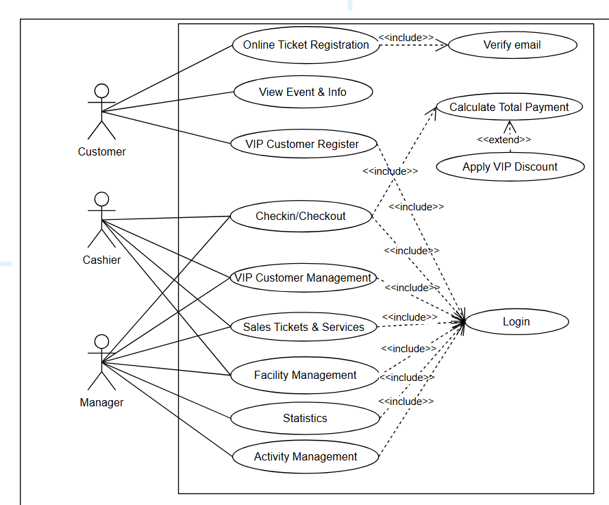

# Intro2SE

- ***PROJECT TITLE:***
    
    Project 5
    Chủ đề: TinkerBellGarden
    Khu vui chơi trẻ em TinkerBellGarden muốn phát triển một ứng dụng để số hoá các
    hoạt động trong trung tâm. Cụ thể có các chức năng như sau: -
    Vé vào khu vui chơi được tính theo lượt chơi, một bé có thể đi kèm với một phụ
    huynh (miễn phí), vé của bé có hai loại giá: Giá chơi 2 tiếng một lượt và giá chơi
    không giới hạn thời gian trong ngày (tính đến giờ khu vui chơi đóng cửa). Khi
    bé chơi vượt quá thời gian thì sẽ tính 50k/30 phút và nhân luỹ tiến, phụ huynh sẽ
    phải trả số tiền vượt trội trước khi rời khỏi khu vui chơi - - - - -
    Vé chơi chỉ có thể chơi các khu trò chơi. Bé có thể tham gia các hoạt động có
    tính phí khác trong khu vui chơi ví dụ: tô tượng, tô tranh, chơi các trò chơi điện
    tử - Vé mua lẻ tại quầy.
    
    Hệ thống cần cung cấp các chức năng để quản lý người chơi hàng ngày, thống
    kê lại cuối ngày
    Hệ thống cho phép quản lý các hoạt động trò chơi trong khu vui chơi, tình trạng
    hỏng hóc cũng như cơ sở vật chất của từng khu trò chơi
    Khu vui chơi có thể tạo các hoạt động đặc biệt nhân các dịp lễ để thu hút các bé
    đến chơi, cho phép phụ huynh đăng ký mua vé tham gia online, hệ thống sẽ gửi
    email xác nhận và phụ huynh có thể trả tiền khi đến tham gia tại khu vui chơi.
    Khi phụ huynh đăng ký tham gia từ sớm sẽ được giảm 20% giá vé vào cửa cho
    ngày diễn ra hoạt động đó.
    Khu vui chơi cũng cho phép đăng ký thành viên VIP và tích điểm mỗi lượt đến
    chơi để có thể nhận được phiếu giảm giá, phiếu tham gia chương trình đặc biệt.
    Phí duy trì thành viên VIP là 400.000/năm, với thành viên VIP, giá vé giảm 20%
    cho 1 bé/1 lượt chơi. Hết năm dương lịch, thành viên VIP cần trả tiền để duy trì
    và hưởng ưu đãi.
    Yêu cầu: phát triển hệ thống trên nền tảng web hoặc trên winform. Nếu lựa chọn
    phát triển trên winform thì yêu cầu có thêm 1 trang web tĩnh cho phép giới thiệu
    khu vui chơi và quảng bá hoạt động để phụ huynh có thể đăng ký tham gia online
    cho bé.
    
- TÀI LIỆU THAM KHẢO:
    
    [https://github.com/hieucuopbien123/TinkerbellGardenFE](https://github.com/hieucuopbien123/TinkerbellGardenFE)
    
    [https://github.com/sonnguyenhong/tinker-bell-garden](https://github.com/sonnguyenhong/tinker-bell-garden)
    
    [TinkerBellGarden-Feasibility Study-2.pdf](TinkerBellGarden-Feasibility_Study-2.pdf)
    
    [SRS.pdf](SRS.pdf)
    
- 0. Admin login/ Customer login
- 1.  Bán vé
    
    Có 2 loại vé cho bé:
    
    - Vé **2 tiếng**
    - Vé **không giới hạn thời gian trong ngày**
    
    Nếu **quá giờ**
    
    - 50k / 30 phút
    - tính **luỹ tiến**
    
    Ví dụ
    
    | Thời gian | Phí |
    | --- | --- |
    | quá 30 phút | 50k |
    | quá 1h | 100k |
    | quá 1h30 | 150k |
- 2.  Quản lý tiện ích khu vui chơi
    
    Ví dụ các khu:
    
    - nhà bóng
    - cầu trượt
    - game điện tử
    
    Hệ thống phải quản lý:
    
    - tên trò chơi
    - trạng thái (hoạt động / hỏng) - report
    - CSVC (ok/ ko)
- 3.  Quản lý người chơi ( Thống kê + Doanh thu, Lượt chơi và tham gia hoạt động khác) - Database
    
    Cần:
    
    - **check-in** bé/ người lớn đi kèm: *thời điểm check in, gói thành viên, gói vé đki( 2/ vô hạn/ multiple)*
    - **check-out** bé/ người lớn đi kèm:*thời điểm check out, gói thành viên, gói vé đki( 2/ vô hạn/ multiple), thời gian sử dụng, thời gian tích lũy nếu có*
    - Tính tiền( lúc check out)
    
    Cuối ngày phải có:
    
    - Thống kê số khách( tùy loại, tổng hợp)
    - Tổng doanh thu
- 4.  Quản lý hoạt đông - Bao gồm sự kiện đặc biệt
    
    Ví dụ: trung thu,halloween,giáng sinh
    
    Phụ huynh có thể:
    
    - đăng ký online
    - nhận email xác nhận
    - trả tiền khi đến, xác thực mail
    
    Nếu **đăng ký email sớm → giảm 20% vé**
    
    → Thanh toán luôn, chỉ check in vs email để lấy vé cứng
    
- 5. Quản lý thành viên VIP
    
    Phụ huynh có thể đăng ký:
    
    - 400k / năm
    
    Quyền lợi:
    
    - giảm **20% vé vào cửa**
    - tích điểm
    - nhận voucher
    
    **Đề xuất**: Với mỗi giờ chơi tích lũy, giảm tiếp 1% trên bill trong tháng đó.
    
    Hết năm phải trả tiền để duy trì+ hưởng ưu đãi
    
- 6.  Hoạt động có tính phí
    
    Ví dụ:
    
    - tô tượng
    - tô tranh
    - game điện tử
    
    Bé muốn chơi phải **trả thêm tiền, mua vé tại quầy**
    
    Hiển thị danh sách item mang trực tiếp tại nhà
    
- II. Ý tưởng
    
    Dựa vào file này để trả lời hết các câu hỏi trên:
    
    The purpose of this document is to provide a detailed description of the software requirements specification for the management system of TinkerBell Garden amusement park and its ticket booking functionality. The document outlines the objectives and key features of the system, its interfaces, operational processes, and the constraints involved when interacting with external inputs.
    
    Briefly describe the proposed system
    
    Technology Stack (Frontend, Backend, Database, Cloud)
    
    Cái nào được sửu dụng trong đây với bài kia nếu dùng Web App
    
    What are the main features of the system?
    Which features are included in Version 1 (MVP)?
    Which features are NOT included in this project? (Out of scope)
    
    External systems or APIs required
    Estimated Development Cost
    Estimated Infrastructure Cost
    Expected benefits of the system
    Estimated project duration
    2 months
    3 months
    4 months
    More than 4 months
    Team Roles (Project manager, backend, frontend, tester, etc.)
    Main technical risks
    External risks
    Risk mitigation plan
    Overall feasibility of the project
    Highly feasible
    Feasible with some risks
    Difficult but possible
    Not feasible
    👍
    
    Which features are NOT included in this project? (Out of scope)
    
- III. Use case
    - Cái này chia ra làm 5 module với 16 Use case
    - Usecase Tổng Quan
        
        
        
    - Module 1: Cổng thông tin & khách hàng (Customer Portal)
        
        *Dành cho người dùng truy cập thông qua website*
        
        - UC1.1: Xem thông tin khu vui chơi
            
            `Khách hàng xem các thông tin giới thiệu chung, bảng giá vé, và danh sách các khu trò chơi/tiện ích hiện có.`
            
        - UC1.2: Xem thông tin sự kiện
            
            `Khách hàng theo dõi các sự kiện đặc biệt sắp hoặc đang diễn ra (ví dụ: Trung thu, Halloween, Giáng sinh).`
            
        - UC1.3: Đăng ký vé tham gia sự kiện online
            
            `Phụ huynh điền form đăng ký trước cho sự kiện. Hệ thống áp dụng mức giảm 20% (Early Bird) và tự động gửi email xác nhận kèm mã đặt chỗ (QR code) để đến thanh toán tại quầy.`
            
        - UC1.4: Đăng ký/Gia hạn thẻ VIP online
            
            `Phụ huynh điền thông tin và đăng ký gói thành viên VIP (400.000 VNĐ/năm) trực tuyến.`
            
        - Usecase M01
            
            
            
    - Module 2: Quản lý bán vé & Thu ngân (Cashier Module)
        
        *Dành cho nhân viên trực tại quầy*
        
        - UC2.1: Bán vé vào cửa
            
            `Nhân viên chọn bán 1 trong 2 loại vé (giới hạn 2 tiếng hoặc không giới hạn thời gian) và ghi nhận số lượng bé/người lớn đi kèm.`
            
        - UC2.2: Bán vé dịch vụ phát sinh (Cân nhắc, có thể bỏ)
            
            `Khách hàng mua thêm các hoạt động có tính phí riêng lẻ như tô tượng, tô tranh, chơi game điện tử tại quầy.`
            
        - UC2.3: Check-in lượt chơi
            
            `Quét mã vé cứng hoặc mã email sự kiện để bắt đầu ghi nhận thời gian chơi. Đồng thời quét thẻ VIP (nếu có) để hệ thống áp dụng giảm 20% và ghi nhận thời gian tích lũy.`
            
        - UC2.4: Checkout + Tính tiền
            
            `Quét vé kết thúc lượt chơi. Hệ thống tự động kiểm tra vé 2 tiếng, tính phí phạt lố giờ luỹ tiến (50k/30 phút), cộng dồn tiền dịch vụ phát sinh, trừ các khoản giảm giá VIP và xuất hóa đơn cuối cùng.`
            
        - UC2.5: Đăng ký/Gia hạn VIP tại quầy
            
            `Nhân viên thực hiện thu 400.000 VNĐ, tạo mới hoặc gia hạn thẻ VIP trực tiếp cho khách tại quầy và cập nhật lên hệ thống.`
            
        - Usecase M02:
            
            
            
    - Module 3: Quản lý
        
        *Dành cho quản lý để giám sát các khu vực trong khu vui chơi*
        
        - UC3.1: Quản lý danh mục trong khu vui chơi
            
            `Quản lý thêm, sửa, xóa thông tin cơ bản của các khu vực vui chơi (ví dụ: khu nhà bóng, cầu trượt, game điện tử).`
            
        - UC3.2: Quản lý dịch vụ tính phí
            
            `Thêm, sửa, xóa và cập nhật bảng giá cho các hạng mục dịch vụ mà khách cần trả thêm tiền (ví dụ: giá các mẫu tượng, tranh tô màu).`
            
        - Vẽ Usecase03
            
            
            
    - Module 4: Quản lý sự kiện & Marketing
        
        *Quảng lý các chiến dịch thu hút khách hàng*
        
        - UC4.1: Tạo chiến dịch sự kiện
            
            `Quản lý thiết lập thông tin sự kiện mới, bao gồm tên, thời gian diễn ra, mô tả và cấu hình giảm giá.`
            
        - UC4.2: Quản lý danh sách đăng ký online
            
            `Quản lý theo dõi danh sách phụ huynh đã đăng ký. Nhân viên/Thu ngân tại quầy đối chiếu, quét mã xác nhận từ email của khách để chuyển trạng thái từ "Chờ thanh toán" sang "Đã thanh toán" và cho phép check-in.`
            
        - Usecase M04:
            
            
            
    - Module 5: Báo cáo & Thống kê
        - UC5.1: Thống kê lưu lượng khách
            
            `Tổng hợp số lượng khách đến khu vui chơi theo thời gian, phân loại theo nhóm đối tượng (vé 2 tiếng/vé full ngày, khách thường/VIP).`
            
        - UC5.2: Báo cáo doanh thu
            
            `Tính toán và hiển thị tổng doanh thu cuối ngày. Hệ thống sẽ tách bạch rõ ràng các nguồn thu: tiền vé vào cửa, tiền phạt lố giờ, doanh thu từ dịch vụ phát sinh và phí duy trì thẻ VIP.`
            
        - Vẽ Usecase05
            
            
            
- IV. Thiết kế ERD - Database
- V. Đặc tả 5 Usecase quan trọng nhất theo form General
    - Usecase tổng quan
        
        
        
    - Usecase module 1: Customer Portal
        - Thông tin tổng quan
            - Tên Module: Customer Portal
            - Actor: Customer (Khách hàng)
            - Mục tiêu: Cho phép khách hàng xem thông tin, đặt sự kiện và quản lý tư cách thành viên VIP qua cổng trực tuyến
        - UC1.1 - Xem thông tin khu vui chơi
            - **Use Case ID**: UC1.1
            - **Use Case Name**: Xem thông tin khu vui chơi
            - **Description**: Cho phép khách hàng xem thông tin công viên
            - **Actor(s)**: Customer
            - **Priority**: Medium
            - **Trigger**: Customer chọn chức năng xem thông tin công viên
            - Pre-Condition: Hệ thống hoạt động bình thường
            - Post-Condition: thông tin công viên được hiển thị
            - Basic Flow:
                1. Customer truy cập hệ thống
                2. Chọn “View Park Information”
                3. Hệ thống hiển thị thông tin
            - **Alternative Flow:**
                - 3a. Không có dữ liệu → hiển thị thông báo
            - **Exception Flow:**
                - E1. Lỗi hệ thống → hiển thị lỗi
            - Business Rules:
                - BR1: Thông tin phải được cập nhật định kỳ
            - **Non-Functional Requirement:**
                - **NFR1: Thời gian tải < 2s**
                
                ****
                
                ****
        - **UC1.2 - Xem thông tin sự kiện**
            - **Use Case ID**: UC1.2
            - **Use Case Name**: Xem thông tin sự kiện
            - **Description**: Xem danh sách và chi tiết sự kiện
            - **Actor(s)**: Customer
            - **Priority**: Medium
            - **Trigger**: Customer chọn xem sự kiện
            - Pre-Condition: Hệ thống có dữ liệu sự kiện
            - Post-Condition: Thông tin sự kiện được hiển thị
            - Basic Flow:
                1. Customer chọn “View Event Information”
                2. Hệ thống hiển thị danh sách
                3. Customer chọn sự kiện
                4. Hiển thị chi tiết
            - **Alternative Flow:**
                - 2a. Không có sự kiện
            - **Exception Flow:**
                - E1. Lỗi truy xuất dữ liệu
                
                ****
            - **Business Rules:**
                - BR1: Sự kiện phải có ngày hợp lệ
                
                ****
            - **Non-Functional Requirement:**
                - NFR1: UI thân thiện
        - **UC1.3 - Đăng ký vé tham gia sự kiện online**
            - **Use Case ID**: UC1.3
            - **Use Case Name**: Đăng ký vé tham gia sự kiện online
            - **Description**: Đặt vé sự kiện online
            - **Actor(s)**: Customer
            - **Priority**: High
            - **Trigger**: Customer chọn đặt vé
            - Pre-Condition:
                - customer có email hợp lệ
            - Post-Condition:
                - Vé được đặt thành công
            - **Basic Flow:**
                1. Customer chọn “Book Event Online”
                2. Nhập thông tin
                3. Hệ thống yêu cầu xác thực email
                4. Customer xác nhận
                5. Hệ thống xử lý đặt vé
                6. Hiển thị thành công
            - **Alternative Flow:**
                - 3a. Email không hợp lệ
                - 5a. Thanh toán thất bại
                
                ****
            - **Exception Flow:**
                - E1. Lỗi thanh toán
                - E2. Lỗi hệ thống
                
                ****
            - Business Rules:
                - BR1: Email phải xác thực trước khi đặt
                - BR2: Vé không hoàn tiền sau khi thanh toán
            - **Non-Functional Requirement:**
                - NFR1: Bảo mật thông tin thanh toán
                - NFR2: Xử lý < 5s
        - UC1.4 - Đăng ký/Gia hạn thẻ VIP online
            - **Use Case ID**: UC1.4
            - **Use Case Name**: Đăng ký/Gia hạn thẻ VIP online
            - **Description**: Cho phép khách hàng đăng ký hoặc gia hạn gói VIP
            - **Actor(s)**: Customer
            - **Priority**: High
            - **Trigger**: Customer chọn chức năng đăng ký VIP
            - **Pre-Condition:**
                - Customer đã có tài khoản *(hoặc hệ thống cho phép đăng ký nhanh nếu chưa có — tùy thiết kế)*
                ****
            - **Post-Condition:**
                - Gói VIP được kích hoạt hoặc gia hạn thành công
            - **Basic Flow:**
                1. Customer chọn “Register VIP Membership”
                2. Hệ thống hiển thị các gói VIP
                3. Customer chọn gói
                4. Customer nhập thông tin thanh toán
                5. Hệ thống xử lý thanh toán
                6. Hệ thống cập nhật trạng thái VIP
                7. Hiển thị thông báo thành công
                
            - **Alternative Flow:**
                - **3a. Không có gói VIP khả dụng → hiển thị thông báo**
                - **4a. Thông tin thanh toán không hợp lệ → yêu cầu nhập lại**
                - **5a. Thanh toán thất bại → cho phép thử lại hoặc hủy**
            - **Exception Flow:**
                - E1. Lỗi hệ thống khi xử lý thanh toán
                - E2. Lỗi kết nối tới cổng thanh toán
            - **Business Rules:**
                - BR1: Gói VIP có thời hạn (ví dụ: 1 tháng, 1 năm)
                - BR2: Không hoàn tiền sau khi kích hoạt
                - BR3: Mỗi tài khoản chỉ có 1 trạng thái VIP tại một thời điểm
            - **Non-Functional Requirement:**
                - NFR1: Bảo mật thanh toán (HTTPS, mã hóa dữ liệu)
                - NFR2: Thời gian xử lý thanh toán < 5 giây
                - NFR3: Hệ thống phải đảm bảo tính nhất quán dữ liệu
    - Usecase module 2: Cashier Module
        - UC2.1: Bán vé vào cửa
            - **Use Case ID**: UC2.1
            - **Use Case Name**: Bán vé vào cửa
            - **Description**: `Nhân viên chọn bán 1 trong 2 loại vé (giới hạn 2 tiếng hoặc không giới hạn thời gian) và ghi nhận số lượng bé/người lớn đi kèm.`
            - **Actor(s)**: Cashier
            - **Priority**: High
            - **Trigger**: Khách yêu cầu mua vé
            - **Pre-Condition(s):**
                - Hệ thống hoạt động
                - Có cấu hình giá vé
            - Post-Condition:
                - Vé được phát hành
            - Basic Flow:
                1. Cashier chọn “Bán vé vào cửa”
                2. Nhập số lượng vé
                3. Hệ thống tính tiền
                4. Cashier nhận thanh toán
                5. Hệ thống in/xuất vé
            - **Alternative Flow:**
                - **2a. Số lượng không hợp lệ → nhập lại**
            - **Exception Flow:**
                - E1. Lỗi in vé
                - E2. Lỗi hệ thống
            - **Business Rules:**
                - BR1: Giá vé theo loại (người lớn/trẻ em)
            - **Non-Functional Requirement:**
                - NFR1: Xử lý nhanh < 3s
            
            ****
            
        - UC2.2: Bán vé dịch vụ phát sinh (Cân nhắc, có thể bỏ)
            - **Use Case ID**: UC2.2
            - **Use Case Name**: Bán vé dịch vụ phát sinh
            - **Description**: `Khách hàng mua thêm các hoạt động có tính phí riêng lẻ như tô tượng, tô tranh, chơi game điện tử tại quầy.`
            - **Actor(s)**: Cashier
            - **Priority**: Medium
            - **Trigger**: Khách yêu cầu dịch vụ
            - **Pre-Condition(s):**
                - Có danh sách dịch vụ
            - **Post-Condition(s):**
                - Dịch vụ được ghi nhận
            - **Basic Flow:**
                1. Cashier chọn dịch vụ
                2. Nhập số lượng
                3. Hệ thống tính tiền
                4. Thanh toán
            - **Alternative Flow:**
                - **1a. Dịch vụ không khả dụng**
            - **Exception Flow:**
                - E1. Lỗi hệ thống
            - **Business Rules:**
                - BR1: Giá dịch vụ cố định
            - **Non-Functional Requirement:**
                - NFR1: Hiển thị nhanh
        - UC2.3: Check-in lượt chơi
            - **Use Case ID**: UC2.3
            - **Use Case Name**: Check-in lượt chơi
            - **Description**: `Quét mã vé cứng hoặc mã email sự kiện để bắt đầu ghi nhận thời gian chơi. Đồng thời quét thẻ VIP (nếu có) để hệ thống áp dụng giảm 20% và ghi nhận thời gian tích lũy.`
            - **Actor(s)**: Cashier
            - **Priority**: High
            - **Trigger**: Khách đến cổng
            - **Pre-Condition(s):**
                - Khách có vé hợp lệ
            - **Post-Condition(s):**
                - Trạng thái vé = đã sử dụng
            - **Basic Flow:**
                1. Cashier quét vé
                2. Hệ thống kiểm tra
                3. Hiển thị hợp lệ
                4. Cho phép vào
            - **Alternative Flow:**
                - **2a. Vé không hợp lệ → từ chối**
            - **Exception Flow:**
                - E1. Lỗi quét mã
            - **Business Rules:**
                - BR1: Mỗi vé chỉ dùng 1 lần
            - **Non-Functional Requirement:**
                - NFR1: Xác thực < 2s
        - **UC2.4: Checkout + Tính tiền**
            - **Use Case ID**: UC2.4
            - **Use Case Name**: Checkout + Tính tiền
            - **Description**: `Quét vé kết thúc lượt chơi. Hệ thống tự động kiểm tra vé 2 tiếng, tính phí phạt lố giờ luỹ tiến (50k/30 phút), cộng dồn tiền dịch vụ phát sinh, trừ các khoản giảm giá VIP và xuất hóa đơn cuối cùng.`
            - **Actor(s)**: Cashier
            - **Priority**: High
            - **Trigger**: Khách kết thúc dịch vụ
            - **Pre-Condition(s):**
                - Có dữ liệu sử dụng dịch vụ
            - **Post-Condition(s):**
                - Hóa đơn được thanh toán
            - **Basic Flow:**
                1. Cashier chọn “Checkout”
                2. Hệ thống **include: Total Cost**
                3. Hiển thị tổng tiền
                4. Cashier nhận thanh toán
                5. Hoàn tất giao dịch
            - **Alternative Flow:**
                - **3a. Khách yêu cầu kiểm tra lại hóa đơn**
                - **4a. Thanh toán thất bại → thử lại**
            - **Exception Flow:**
                - E1. Lỗi hệ thống
                - E2. Lỗi kết nối thanh toán
            - **Business Rules:**
                - BR1: Tổng tiền = vé + dịch vụ
            - **Non-Functional Requirement:**
                - NFR1: Tính toán chính xác 100%
                - NFR2: Xử lý < 3s
                
            - UC2.4.1a: VIP Discount (extend)
                - **Use Case ID**: UC2.4.1a
                - **Use Case Name**: VIP Discount
                - **Description**: Áp dụng giảm giá VIP
                - **Trigger:**
                    - Khách là VIP
                - **Basic Flow:**
                    1. Kiểm tra trạng thái VIP
                    2. Áp dụng giảm giá
            - UC2.4.1b: Calculate Overtime Payment (extend)
                - **Use Case ID**: UC2.4.1b
                - **Use Case Name**: Calculate Overtime Payment
                - **Description**: Tính phí quá giờ
                - **Trigger:** Khách vượt thời gian quy định
                - **Basic Flow:**
                    1. Tính thời gian vượt
                    2. Áp dụng phí
            
        - UC2.5: Đăng ký/Gia hạn VIP tại quầy
            - **Use Case ID**: UC2.5
            - **Use Case Name**: Đăng ký/Gia hạn VIP tại quầy
            - **Description**: `Nhân viên thực hiện thu 400.000 VNĐ, tạo mới hoặc gia hạn thẻ VIP trực tiếp cho khách tại quầy và cập nhật lên hệ thống.`
            - **Actor(s)**: Cashier
            - **Priority**: Medium
            - **Trigger**: Khách yêu cầu
            - **Pre-Condition(s):**
                - Khách cung cấp thông tin
            - **Post-Condition(s):**
                - VIP được cập nhật
            - **Basic Flow:**
                1. Cashier nhập thông tin khách
                2. Chọn gói VIP
                3. Thanh toán
                4. Hệ thống cập nhật
            - **Alternative Flow:**
                - **1a. Thiếu thông tin → nhập lại**
                - **3a. Thanh toán thất bại**
            - **Exception Flow:**
                - E1. Lỗi hệ thống
            - **Business Rules:**
                - BR1: VIP có thời hạn
            - **Non-Functional Requirement:**
                - NFR1: Bảo mật dữ liệu khách
    - Usecase module 3: Quản lý
        - UC3.1: Quản lý danh mục trong khu vui chơi
            - **Use Case ID**: UC3.1
            - **Use Case Name**: Quản lý danh mục trong khu vui chơi
            - **Description**: `Quản lý thêm, sửa, xóa thông tin cơ bản của các khu vực vui chơi (ví dụ: khu nhà bóng, cầu trượt, game điện tử).`
            - **Actor(s)**: Manager
            - **Priority**: High
            - **Trigger**: Manager truy cập chức năng
            - **Pre-Condition(s):**
                - Manager đăng nhập
            - **Post-Condition(s):**
                - Dữ liệu facility được cập nhật
            - **Basic Flow:**
                1. Manager chọn “Manage Facility”
                2. Hệ thống hiển thị danh sách
                3. Manager thao tác quản lý
            - **Alternative Flow:**
                - **2a. Không có dữ liệu**
            - **Exception Flow:**
                - E1. Lỗi hệ thống
            - **Business Rules:**
                - BR1: Mỗi facility có ID duy nhất
            - UC3.2a: View Facility List (extend)
                - Hiển thị danh sách facility
            - UC3.2b: Search Facility (extend)
                - Tìm kiếm theo tên / ID
            - UC3.2c: Add/Delete Facility (extend)
                - Thêm hoặc xóa facility
            - UC3.2d: Add Info Facility (extend)
                - Thêm thông tin chi tiết
            - UC3.2e: View Facility Details (extend)
                - Xem chi tiết facility
            - UC3.2f: Update Facility (extend)
                - Cập nhật thông tin
            - UC3.2g: Report Facility Status (extend từ Update Facility)
                - Báo cáo trạng thái (hỏng, bảo trì…)
        - **UC3.2: Quản lý dịch vụ**
            - **Use Case ID**: UC3.1
            - **Use Case Name**: Quản lý dịch vụ
            - **Description**: `Quản lý thêm, sửa, xóa thông tin cơ bản của các khu vực vui chơi (ví dụ: khu nhà bóng, cầu trượt, game điện tử).`
            - **Actor(s)**: Manager
            - **Priority**: High
            - **Trigger**: Manager truy cập chức năng quản lý dịch vụ
            - **Pre-Condition(s):**
                - Manager đã đăng nhập
            - **Post-Condition(s):**
                - Dữ liệu dịch vụ được cập nhật
            - **Basic Flow:**
                1. Manager chọn “Manage Additional Service”
                2. Hệ thống hiển thị danh sách dịch vụ
                3. Manager thực hiện thao tác quản lý
            - **Alternative Flow:**
                - **3a. Không có dữ liệu → hiển thị rỗng**
            - **Exception Flow:**
                - E1. Lỗi hệ thống
            - **Business Rules:**
                - BR1: Tên dịch vụ là duy nhất
            - **Non-Functional Requirement:**
                - NFR1: Phản hồi < 2s
            - UC3.1a: Add/Remove Service (extend)
                - **Use Case ID**: UC3.1a
                - **Use Case Name**: Add/Remove Service
                - **Description**: Thêm hoặc xóa dịch vụ
                - **Trigger:**
                    - Manager chọn thao tác thêm/xóa
                - **Basic Flow:**
                    1. Nhập thông tin dịch vụ
                    2. Lưu hoặc xóa
                - **Alternative Flow:**
                    - **1a. Thiếu thông tin → nhập lại**
            - UC3.1b: Update Pricing (extend)
                - **Use Case ID**: UC3.1b
                - **Use Case Name**: Update Pricing
                - **Description**: Cập nhật giá dịch vụ
            - **Basic Flow:**
                1. Chọn dịch vụ
                2. Nhập giá mới
                3. Lưu
            - Business Rules:
                - BR1: Giá > 0
    - Usecase module 4: Quản lý sự kiện & Marketing
        - **UC4.1: Tạo chiến dịch sự kiện**
            - **Use Case ID**: UC4.1
            - **Use Case Name**: Tạo chiến dịch sự kiện
            - **Description**: Quản lý chiến dịch sự kiện (tạo, chỉnh sửa, tìm kiếm, áp dụng giảm giá)
            - **Actor(s)**: Manager
            - **Priority**: High
            - **Trigger**: Manager truy cập chức năng quản lý sự kiện
            - **Pre-Condition(s):**
                - Manager đã đăng nhập
                - Hệ thống sẵn sàng
            - **Post-Condition(s):**
                - Chiến dịch sự kiện được tạo/cập nhật
            - **Basic Flow:**
                1. Manager chọn “Manage Event Campaign”
                2. Hệ thống hiển thị danh sách sự kiện
                3. Manager chọn thao tác (thêm/sửa/tìm kiếm)
                4. Hệ thống lưu thay đổi
            - **Alternative Flow:**
                - **2a. Không có sự kiện → hiển thị danh sách rỗng**
                - **3a. Dữ liệu nhập không hợp lệ → yêu cầu nhập lại**
            - **Exception Flow:**
                - E1. Lỗi hệ thống
                - E2. Lỗi lưu dữ liệu
            - **Business Rules:**
                - BR1: Mỗi sự kiện có ID duy nhất
                - BR2: Thời gian bắt đầu < thời gian kết thúc
            - **Non-Functional Requirement:**
                - NFR1: Phản hồi < 2s
                - NFR2: Dữ liệu nhất quán
            - UC4.1a: Add/Delete Event (extend)
                - Thêm hoặc xóa sự kiện
            - UC4.1b: Edit Event (extend)
                - Chỉnh sửa thông tin sự kiện
            - UC4.1c: Search Event (extend)
                - Tìm kiếm sự kiện
            - UC4.1d: Apply Discount (extend)
                - Áp dụng giảm giá cho sự kiện
            - Trigger:
                - Khi có chương trình khuyến mãi
            - Business Rules:
                - BR: Discount ≤ 100%
        - UC4.2: Quản lý danh sách đăng ký online
            - **Use Case ID**: UC4.2
            - **Use Case Name**: Online Bookings Management
            - **Description**: Quản lý danh sách khách đăng ký online
            - **Actor(s)**: Manager
            - **Priority**: High
            - **Trigger**: Manager truy cập danh sách đăng ký
            - **Pre-Condition(s):**
                - Có dữ liệu booking
            - **Post-Condition(s):**
                - Trạng thái booking được cập nhật
            - **Basic Flow:**
                1. Manager chọn “Online Bookings”
                2. Hệ thống hiển thị danh sách
                3. Manager xem chi tiết booking
            - **Alternative Flow:**
                - **2a. Không có dữ liệu**
            - **Exception Flow:**
                - E1. Lỗi truy xuất dữ liệu
            - **Business Rules:**
                - BR1: Mỗi booking có mã riêng
            - **Non-Functional Requirement:**
                - NFR1: Hiển thị nhanh
    - Usecase module 5: Báo cáo & Thống kê
        - UC5.1: Thống kê lưu lượng khách
            
            **Use Case ID:** UC5.1
            
            **Use Case Name:** Thống kê lưu lượng khách hàng
            
            **Description:** `Tổng hợp số lượng khách đến khu vui chơi theo thời gian, phân loại theo nhóm đối tượng (vé 2 tiếng/vé full ngày, khách thường/VIP).`
            
            **Actor(s):** Manager
            
            **Priority:** High
            
            **Trigger:** Manager truy cập chức năng xem thống kê khách truy cập
            
            ### **Pre-Condition(s):**
            
            - Manager đã đăng nhập
            - Hệ thống hoạt động bình thường
            
            ### **Post-Condition(s):**
            
            - Thống kê khách truy cập được hiển thị theo tiêu chí đã chọn
            
            ### **Basic Flow:**
            
            1. Manager chọn “View Visitor Statistics”
            2. Hệ thống hiển thị dữ liệu thống kê khách truy cập
            3. Manager chọn bộ lọc (Ticket/Customer hoặc Day/Week/Month)
            4. Hệ thống cập nhật và hiển thị kết quả
            
            ### **Alternative Flow:**
            
            - **2a.** Không có dữ liệu → hiển thị thông báo “No data available”
            - **3a.** Không chọn bộ lọc → hiển thị dữ liệu mặc định
            
            ### **Exception Flow:**
            
            - **E1.** Lỗi hệ thống → hiển thị thông báo lỗi
            - **E2.** Lỗi truy vấn dữ liệu → không hiển thị kết quả
            
            ### **Business Rules:**
            
            - **BR1:** Dữ liệu thống kê phải chính xác và cập nhật theo thời gian thực
            - **BR2:** Bộ lọc thời gian phải hợp lệ (Day/Week/Month)
            
            ### **Non-Functional Requirements:**
            
            - **NFR1:** Thời gian phản hồi < 2s
            - **NFR2:** Giao diện hiển thị trực quan, dễ hiểu
        - UC5.2: Báo cáo doanh thu
            
            **Use Case ID:** UC5.2
            
            **Use Case Name:** Báo cáo doanh thu
            
            **Description:** Cho phép Manager xem thống kê doanh thu và lọc theo nguồn (source).
            
            **Actor(s):** Manager
            
            **Priority:** High
            
            **Trigger:** Manager truy cập chức năng xem thống kê doanh thu
            
            ### **Pre-Condition(s):**
            
            - Manager đã đăng nhập
            - Hệ thống sẵn sàng
            
            ### **Post-Condition(s):**
            
            - Thống kê doanh thu được hiển thị theo bộ lọc
            
            ### **Basic Flow:**
            
            1. Manager chọn “Revenue Statistics”
            2. Hệ thống hiển thị dữ liệu doanh thu
            3. Manager chọn “Filter by source”
            4. Hệ thống cập nhật kết quả theo nguồn
            
            ### **Alternative Flow:**
            
            - **2a.** Không có dữ liệu → hiển thị danh sách rỗng
            - **3a.** Không chọn source → hiển thị toàn bộ
            
            ### **Exception Flow:**
            
            - **E1.** Lỗi hệ thống
            - **E2.** Lỗi tải dữ liệu
            
            ### **Business Rules:**
            
            - **BR1:** Doanh thu phải được tính chính xác theo nguồn
            - **BR2:** Source phải thuộc danh sách hợp lệ
            
            ### **Non-Functional Requirements:**
            
            - **NFR1:** Phản hồi < 2s
            - **NFR2:** Dữ liệu đồng bộ và nhất quán
- Cấu trúc thư mục (dễ check):
    - Root Directory
    
    ```powershell
    tinkerbell-garden/
    ├── client/                 # Frontend App (Web tĩnh & Portal cho Admin/Thu ngân)
    ├── server/                 # Backend API (Xử lý toàn bộ logic, tính toán)
    ├── docs/                   # Chứa tài liệu SRS, sơ đồ Database, Use Case
    └── README.md
    ```
    
    - Backend
        
        ```powershell
        server/
        ├── src/
        │   ├── config/             # Cấu hình Database, biến môi trường, Mailer
        │   ├── middlewares/        # Phân quyền (Auth), xử lý lỗi (Error Handler)
        │   ├── utils/              # Các hàm dùng chung (format ngày, mã hóa mật khẩu)
        │   │
        │   ├── modules/            # PHÂN CHIA THEO MODULE & USE CASE
        │   │   │
        │   │   ├── auth/           # Đăng nhập Admin / Cashier
        │   │   │
        │   │   ├── portal/         # [Module 1] Cổng thông tin & Khách hàng
        │   │   │   ├── portal.controller.js  # (UC1.1, UC1.2) API lấy thông tin khu vui chơi, sự kiện cho web
        │   │   │   ├── portal.service.js
        │   │   │   └── portal.routes.js
        │   │   │
        │   │   ├── ticket/         # [Module 2] Quản lý Bán vé & Thu ngân (CORE)
        │   │   │   ├── ticket.controller.js  # Xử lý API request
        │   │   │   ├── ticket.service.js     # Chứa logic tính phí phạt, thời gian tích luỹ
        │   │   │   ├── ticket.model.js       # Schema lưu vé và giao dịch
        │   │   │   └── ticket.routes.js
        │   │   │   # Phục vụ: 
        │   │   │   # - UC2.1, UC2.2: Bán vé và dịch vụ
        │   │   │   # - UC2.3: Check-in
        │   │   │   # - UC2.4: Check-out & Tính tiền luỹ tiến
        │   │   │
        │   │   ├── customer/       # Quản lý khách hàng & thẻ VIP
        │   │   │   ├── customer.controller.js
        │   │   │   ├── customer.service.js   # Logic đăng ký VIP, kiểm tra hạn VIP
        │   │   │   ├── customer.model.js
        │   │   │   └── customer.routes.js
        │   │   │   # Phục vụ: UC1.4 (Mua online), UC2.5 (Mua tại quầy)
        │   │   │
        │   │   ├── facility/       # [Module 3] Quản lý Cơ sở vật chất & Trò chơi
        │   │   │   ├── facility.controller.js
        │   │   │   ├── facility.service.js
        │   │   │   ├── facility.model.js
        │   │   │   └── facility.routes.js
        │   │   │   # Phục vụ: UC3.1 (DS trò chơi), UC3.2 (Trạng thái hỏng), UC3.3 (Dịch vụ tính phí)
        │   │   │
        │   │   ├── event/          # [Module 4] Quản lý Sự kiện
        │   │   │   ├── event.controller.js
        │   │   │   ├── event.service.js      # Logic tạo booking, gửi email xác nhận, QR Code
        │   │   │   ├── event.model.js
        │   │   │   └── event.routes.js
        │   │   │   # Phục vụ: UC1.3 (Khách book sự kiện), UC4.1 (Tạo sự kiện), UC4.2 (Duyệt mail)
        │   │   │
        │   │   └── report/         # [Module 5] Báo cáo & Thống kê
        │   │       ├── report.controller.js
        │   │       ├── report.service.js     # Query tổng hợp doanh thu cuối ngày
        │   │       └── report.routes.js
        │   │       # Phục vụ: UC5.1, UC5.2
        │   │
        │   ├── jobs/               # Background Jobs (Cronjob)
        │   │   └── vip-renewal.job.js        # Chạy tự động đêm 31/12 để reset thẻ VIP
        │   │
        │   └── app.js              # Entry point kết nối các routes
        ├── package.json
        └── .env
        ```
        
    - Frontend
        
        ```powershell
        client/
        ├── public/
        ├── src/
        │   ├── assets/             # Hình ảnh (logo, banner sự kiện), css, fonts
        │   ├── components/         # Các UI component dùng chung (Button, Table, Modal, Toast)
        │   ├── layouts/            # Layout bọc ngoài các trang
        │   │   ├── PortalLayout/   # Layout cho Web tĩnh (Header, Footer cho phụ huynh)
        │   │   └── AdminLayout/    # Layout cho Trang quản trị (Sidebar, Navbar cho nhân viên)
        │   ├── services/           # Cấu hình gọi API (Axios instance, Interceptors)
        │   │
        │   ├── modules/            # PHÂN CHIA COMPONENT VÀ PAGE THEO USE CASE
        │   │   │
        │   │   ├── portal/         # [Giao diện Phụ huynh]
        │   │   │   ├── pages/
        │   │   │   │   ├── HomePage.jsx      # (UC1.1) Giới thiệu, bảng giá
        │   │   │   │   ├── EventsPage.jsx    # (UC1.2) Danh sách sự kiện
        │   │   │   │   ├── EventBooking.jsx  # (UC1.3) Form đăng ký nhận mã QR
        │   │   │   │   └── VipRegister.jsx   # (UC1.4) Form mua thẻ VIP online
        │   │   │   └── components/
        │   │   │
        │   │   ├── cashier/        # [Giao diện Thu ngân]
        │   │   │   ├── pages/
        │   │   │   │   ├── Ticketing.jsx     # (UC2.1, UC2.2) Giao diện bán vé, chọn dịch vụ
        │   │   │   │   ├── CheckIn.jsx       # (UC2.3) Quét mã, bắt đầu tính giờ
        │   │   │   │   ├── CheckOut.jsx      # (UC2.4) Tính tiền phạt luỹ tiến, in bill
        │   │   │   │   └── VipManager.jsx    # (UC2.5) Đăng ký thẻ VIP tại quầy
        │   │   │   └── components/
        │   │   │       ├── PenaltyCalculatorModal.jsx # Component hiển thị preview tiền phạt
        │   │   │
        │   │   ├── facility/       # [Giao diện Quản lý Cơ sở vật chất]
        │   │   │   ├── pages/
        │   │   │   │   ├── GamesManager.jsx  # (UC3.1) Bảng danh sách trò chơi
        │   │   │   │   ├── StatusReport.jsx  # (UC3.2) Cập nhật hỏng hóc
        │   │   │   │   └── Services.jsx      # (UC3.3) Quản lý giá dịch vụ phụ
        │   │   │
        │   │   ├── event/          # [Giao diện Quản lý Sự kiện]
        │   │   │   ├── pages/
        │   │   │   │   ├── EventCampaigns.jsx # (UC4.1) Thêm, sửa, xoá sự kiện
        │   │   │   │   └── BookingsList.jsx   # (UC4.2) Quét và xác thực email phụ huynh
        │   │   │
        │   │   └── report/         # [Giao diện Báo cáo]
        │   │       ├── pages/
        │   │       │   ├── DailyRevenue.jsx   # (UC5.2) Bảng doanh thu, xuất file Excel
        │   │       │   └── VisitorStats.jsx   # (UC5.1) Biểu đồ lượng khách
        │   │
        │   ├── routes/             # Định tuyến URL (React Router)
        │   │   ├── index.js        # Cấu hình route /admin, /cashier, /...
        │   │   └── PrivateRoute.jsx # Chặn quyền không cho người ngoài vào Admin
        │   │
        │   └── utils/              # Các hàm format tiền VNĐ, format giờ
        ├── package.json
        └── vite.config.js
        ```