# Database & API Design - TinkerBell Garden

Tài liệu này được đối chiếu trực tiếp từ các file đang chạy thật trong backend:

- `server/database.sql`
- `server/src/app.js`
- `server/src/modules/auth`
- `server/src/modules/customer`
- `server/src/modules/event`
- `server/src/modules/facility`
- `server/src/modules/portal`
- `server/src/modules/report`
- `server/src/modules/staff`
- `server/src/modules/ticket`

Lưu ý về cấu trúc thư mục:

- `server/src/modules/transaction` là module helper nội bộ để ghi `Transactions`, không được mount thành router public trong `app.js`.
- Hiện tại backend chỉ mount 8 nhóm API public: `auth`, `portal`, `customers`, `events`, `facilities`, `reports`, `staff`, `tickets`.

## 1. Cấu trúc module backend thực tế

| Module thư mục | Router mount trong `app.js` | Vai trò |
| --- | --- | --- |
| `auth` | `/api/auth` | Đăng nhập staff/customer, đăng ký customer, lấy user hiện tại, đổi mật khẩu |
| `portal` | `/api/portal` | API public cho trang khách hàng: khu vui chơi, dịch vụ, sự kiện, VIP online, đặt vé |
| `customer` | `/api/customers` | Hồ sơ khách hàng, tra cứu customer, quản lý VIP, duyệt VIP online |
| `event` | `/api/events` | CRUD sự kiện, danh sách đăng ký online, booking cũ, xác nhận thanh toán |
| `facility` | `/api/facilities` | Khu vui chơi, dịch vụ tính phí, sản phẩm, ảnh upload, phân công cashier |
| `report` | `/api/reports` | Dashboard, visitor stats, revenue report |
| `staff` | `/api/staff` | Quản lý nhân viên cho Manager |
| `ticket` | `/api/tickets` | Vé cổng, check-in/check-out, POS thanh toán riêng |

## 2. Entity Relationship Diagram

Sơ đồ dưới đây phản ánh đúng schema hiện tại trong `server/database.sql`.

```mermaid
erDiagram
  STAFF {
    INT StaffID PK
    VARCHAR_120 FullName
    VARCHAR_50 Username UK
    VARCHAR_255 PasswordHash
    ENUM Role "Manager, Cashier"
    VARCHAR_20 CCCD
    BOOLEAN Active
    DATETIME CreatedAt
  }

  CUSTOMER {
    INT CustomerID PK
    VARCHAR_120 FullName
    VARCHAR_120 Email UK
    VARCHAR_20 Phone UK
    VARCHAR_255 PasswordHash
    BOOLEAN IsVIP
    DATETIME VIPExpiryDate
    DECIMAL_10_2 AccumulatedHours
    INT LoyaltyPoints
    DATETIME CreatedAt
    DATETIME UpdatedAt
  }

  TICKET_TYPE {
    INT TypeID PK
    VARCHAR_30 Code UK
    VARCHAR_80 TypeName
    DECIMAL_18_2 BasePrice
    INT TimeLimit
    BOOLEAN Active
  }

  FACILITY {
    INT FacilityID PK
    VARCHAR_120 FacilityName
    TEXT Description
    ENUM Status "Normal, Broken, Maintenance"
    ENUM AssetStatus "Ok, Issue"
    INT Capacity
    VARCHAR_255 ImageURL
    DATETIME CreatedAt
    DATETIME UpdatedAt
  }

  STAFF_AREA_ASSIGNMENT {
    INT StaffID PK, FK
    ENUM AreaType "Gate, Facility"
    INT FacilityID FK
    DATETIME UpdatedAt
  }

  FACILITY_CASHIER {
    INT FacilityID PK, FK
    INT StaffID PK, FK
    DATETIME AssignedAt
  }

  FACILITY_ISSUE {
    INT IssueID PK
    INT FacilityID FK
    VARCHAR_255 Description
    BOOLEAN IsResolved
    DATETIME CreatedAt
    DATETIME ResolvedAt
  }

  PAID_SERVICE {
    INT ServiceID PK
    INT FacilityID FK
    VARCHAR_120 ServiceName
    TEXT Description
    VARCHAR_255 ImageURL
    BOOLEAN Active
    DATETIME CreatedAt
    DATETIME UpdatedAt
  }

  PRODUCT {
    INT ProductID PK
    INT FacilityID FK
    INT ServiceID FK
    VARCHAR_120 ProductName
    VARCHAR_80 Category
    DECIMAL_18_2 Price
    INT Stock
    VARCHAR_255 ImageURL
    BOOLEAN Active
    DATETIME CreatedAt
    DATETIME UpdatedAt
  }

  RETAIL_ORDER {
    INT OrderID PK
    INT CustomerID FK
    INT StaffID FK
    DECIMAL_18_2 TotalAmount
    ENUM Source "Service, VipMembership"
    ENUM Status "Paid, Cancelled"
    DATETIME OrderDate
  }

  RETAIL_ORDER_DETAIL {
    INT OrderID PK, FK
    INT ProductID PK, FK
    INT Quantity
    DECIMAL_18_2 UnitPrice
  }

  EVENT_CAMPAIGN {
    INT EventID PK
    VARCHAR_120 EventName
    VARCHAR_80 EventType
    TEXT Description
    VARCHAR_120 ScaleText
    DECIMAL_18_2 EstimatedCost
    VARCHAR_160 Sponsor
    DATE PlannedDate
    TIME StartTime
    TIME EndTime
    DATE RegistrationDeadline
    ENUM DeliveryMode "Online, Offline, Hybrid"
    DATETIME StartDate
    DATETIME EndDate
    DECIMAL_18_2 TicketPrice
    DECIMAL_5_4 DiscountRate
    DECIMAL_5_2 OnlineDiscountPercent
    LONGTEXT MarketingHtml
    INT Capacity
    ENUM Status "Draft, Published, Archived"
    DATETIME CreatedAt
    DATETIME UpdatedAt
  }

  EVENT_BOOKING {
    INT BookingID PK
    INT EventID FK
    INT CustomerID FK
    VARCHAR_120 ChildName
    INT ChildAge
    INT Quantity
    DECIMAL_18_2 UnitPrice
    DECIMAL_18_2 DiscountAmount
    DECIMAL_18_2 FinalAmount
    DATETIME BookingDate
    VARCHAR_80 QRCode UK
    ENUM Status "PendingPayment, Paid, CheckedIn, Cancelled"
    DATETIME PaidAt
    DATETIME CheckedInAt
  }

  EVENT_REGISTRATION {
    INT RegistrationID PK
    INT EventID FK
    INT CustomerID FK
    VARCHAR_120 ParentName
    VARCHAR_30 Phone
    VARCHAR_120 Email
    INT TicketCount
    DECIMAL_18_2 UnitPrice
    DECIMAL_5_2 EarlyDiscountPercent
    DECIMAL_5_2 VipDiscountPercent
    DECIMAL_18_2 FinalAmount
    VARCHAR_255 TransferContent
    ENUM Status "PendingTransfer, TransferSubmitted, Confirmed, Cancelled"
    DATETIME PaidAt
    INT TransactionID "logical link"
    DATETIME SubmittedAt
  }

  EVENT_REGISTRATION_CHILD {
    INT ChildID PK
    INT RegistrationID FK
    INT RowNo
    VARCHAR_120 ChildName
    VARCHAR_30 Mobile
    DATE BirthDate
  }

  TICKET_RESERVATION {
    INT ReservationID PK
    INT TypeID FK
    INT CustomerID FK
    INT ChildrenCount
    INT AdultsCount
    DATE VisitDate
    JSON ChildrenJson
    TEXT SpecialRequests
    DECIMAL_18_2 UnitPrice
    DECIMAL_18_2 DiscountAmount
    DECIMAL_18_2 FinalAmount
    VARCHAR_80 QRCode UK
    ENUM Status "PendingPayment, Paid, Cancelled"
    DATETIME PaidAt
    DATETIME CreatedAt
  }

  PLAY_SESSION {
    INT SessionID PK
    INT CustomerID FK
    INT TypeID FK
    INT EventID FK
    INT StaffID FK
    VARCHAR_120 GuestName
    ENUM Purpose "Play, Event"
    ENUM Source "Counter, EventBooking"
    INT EventBookingID FK
    INT EventRegistrationID FK
    BOOLEAN PrepaidOnline
    INT ChildrenCount
    INT AdultsCount
    ENUM PaymentMethod "Tiền mặt, Chuyển khoản"
    DECIMAL_18_2 PaidAmount
    DATETIME CheckinTime
    DATETIME CheckoutTime
    ENUM Status "Pending, Playing, Completed, Cancelled"
  }

  SESSION_SERVICE {
    INT ServiceLineID PK
    INT SessionID FK
    INT ProductID FK
    INT Quantity
    DECIMAL_18_2 UnitPrice
    DECIMAL_18_2 LineTotal
  }

  TICKET_INVOICE {
    INT InvoiceID PK
    INT SessionID FK
    INT StaffID FK
    DECIMAL_18_2 TicketFee
    DECIMAL_18_2 OvertimePenalty
    DECIMAL_18_2 ServiceAmount
    DECIMAL_18_2 VIPDiscount
    DECIMAL_18_2 FinalAmount
    DATETIME CreatedAt
  }

  VIP_TRANSACTION {
    INT VIPTransactionID PK
    INT CustomerID FK
    INT StaffID FK
    DECIMAL_18_2 Amount
    ENUM Channel "Online, Counter"
    ENUM TransactionType "Register, Renew"
    ENUM Status "Paid, Cancelled"
    DATETIME PaidAt
  }

  TRANSACTIONS {
    INT TransactionID PK
    DECIMAL_18_2 Amount
    ENUM Type "Vé vào cửa, Dịch vụ lẻ, Phạt lố giờ, VIP, Sự kiện"
    ENUM PaymentMethod "Tiền mặt, Chuyển khoản"
    DATETIME Timestamp
    INT StaffID FK
    INT CustomerID FK
    INT SessionID FK
    INT OrderID FK
    INT EventRegistrationID FK
    INT VIPTransactionID FK
    VARCHAR_255 Note
  }

  VIP_PAYMENT_REQUEST {
    INT VipRequestID PK
    INT CustomerID FK
    INT Years
    DECIMAL_18_2 Amount
    ENUM RequestType "Register, Renew"
    ENUM Status "PendingReview, Approved, Cancelled"
    VARCHAR_255 TransferContent
    DATETIME CreatedAt
  }

  EMAIL_OUTBOX {
    INT EmailID PK
    VARCHAR_120 RecipientEmail
    VARCHAR_200 Subject
    TEXT HtmlBody
    ENUM Status "PendingConfiguration, Sent, Failed"
    VARCHAR_255 ProviderMessageID
    TEXT ErrorMessage
    DATETIME CreatedAt
  }

  STAFF ||--o| STAFF_AREA_ASSIGNMENT : assigned
  FACILITY ||--o{ STAFF_AREA_ASSIGNMENT : scoped_to
  STAFF ||--o{ FACILITY_CASHIER : assigned
  FACILITY ||--o{ FACILITY_CASHIER : has
  FACILITY ||--o{ FACILITY_ISSUE : has
  FACILITY ||--o{ PAID_SERVICE : has
  FACILITY ||--o{ PRODUCT : owns
  PAID_SERVICE ||--o{ PRODUCT : groups

  CUSTOMER ||--o{ RETAIL_ORDER : places
  STAFF ||--o{ RETAIL_ORDER : creates
  RETAIL_ORDER ||--o{ RETAIL_ORDER_DETAIL : contains
  PRODUCT ||--o{ RETAIL_ORDER_DETAIL : sold_as

  EVENT_CAMPAIGN ||--o{ EVENT_BOOKING : has
  CUSTOMER ||--o{ EVENT_BOOKING : books
  EVENT_CAMPAIGN ||--o{ EVENT_REGISTRATION : has
  CUSTOMER ||--o{ EVENT_REGISTRATION : registers
  EVENT_REGISTRATION ||--o{ EVENT_REGISTRATION_CHILD : contains

  TICKET_TYPE ||--o{ TICKET_RESERVATION : reserved_as
  CUSTOMER ||--o{ TICKET_RESERVATION : owns

  CUSTOMER ||--o{ PLAY_SESSION : participates
  TICKET_TYPE ||--o{ PLAY_SESSION : uses
  EVENT_CAMPAIGN ||--o{ PLAY_SESSION : event_of
  STAFF ||--o{ PLAY_SESSION : handled_by
  EVENT_BOOKING ||--o{ PLAY_SESSION : source_booking
  EVENT_REGISTRATION ||--o{ PLAY_SESSION : source_registration
  PLAY_SESSION ||--o{ SESSION_SERVICE : contains
  PRODUCT ||--o{ SESSION_SERVICE : uses
  PLAY_SESSION ||--o{ TICKET_INVOICE : summarized_in
  STAFF ||--o{ TICKET_INVOICE : issued_by

  CUSTOMER ||--o{ VIP_TRANSACTION : pays
  STAFF ||--o{ VIP_TRANSACTION : processed_by
  CUSTOMER ||--o{ VIP_PAYMENT_REQUEST : requests

  STAFF ||--o{ TRANSACTIONS : records
  CUSTOMER ||--o{ TRANSACTIONS : pays
  PLAY_SESSION ||--o{ TRANSACTIONS : checkout_of
  RETAIL_ORDER ||--o{ TRANSACTIONS : payment_of
  EVENT_REGISTRATION ||--o{ TRANSACTIONS : event_payment
  VIP_TRANSACTION ||--o{ TRANSACTIONS : vip_payment
```

### Ghi chú ERD

- `Facility` và `Staff` có quan hệ nhiều-nhiều qua `FacilityCashier`.
- `StaffAreaAssignment` là phân công chính thức cho cashier ở cổng hoặc khu phụ trách.
- `Facility -> PaidService -> Product` là trục dữ liệu của module dịch vụ tính phí.
- `PlaySession` là hạt nhân của luồng check-in/check-out cổng chính, còn `Transactions` là hạt nhân doanh thu.
- `SessionService` vẫn còn trong schema để phản ánh hướng thiết kế hậu thanh toán trước đây, nhưng luồng đang chạy thực tế cho dịch vụ phát sinh hiện đi theo `RetailOrder` + `RetailOrderDetail` + `Transactions` dưới hình thức thanh toán riêng tại quầy.
- `EventRegistration.TransactionID` hiện là tham chiếu logic, không có FK constraint trong schema.
- `EmailOutbox` là bảng hạ tầng gửi mail, độc lập với các module nghiệp vụ khác.

## 3. Bảng API thực tế theo đúng router đang mount

Base URL backend: `http://localhost:5000/api`

### 3.1. Auth module - `server/src/modules/auth`

| Method | Endpoint | Input | Mô tả |
| --- | --- | --- | --- |
| GET | `/api/health` | Không có | Health check của backend |
| POST | `/api/auth/staff/login` | `{ username, password }` | Đăng nhập staff |
| POST | `/api/auth/customer/login` | `{ emailOrPhone, password }` | Đăng nhập customer |
| POST | `/api/auth/customer/register` | `{ fullName, email, phone, password }` | Đăng ký customer |
| POST | `/api/auth/login` | `{ identifier, password }` | Đăng nhập tổng hợp staff hoặc customer |
| GET | `/api/auth/me` | Header JWT | Lấy user hiện tại |
| POST | `/api/auth/change-password` | `{ currentPassword, newPassword, confirmPassword }` | Đổi mật khẩu cho cả staff và customer |

### 3.2. Portal module - `server/src/modules/portal`

| Method | Endpoint | Input | Mô tả |
| --- | --- | --- | --- |
| GET | `/api/portal/info` | Không có | Dữ liệu public cho trang chủ |
| GET | `/api/portal/services/:serviceId` | `serviceId` | Chi tiết một dịch vụ tính phí |
| GET | `/api/portal/events` | Không có | Danh sách sự kiện public |
| GET | `/api/portal/events/:id` | `id` | Chi tiết sự kiện public |
| POST | `/api/portal/events/:id/register` | `{ parentName, phone, email, ticketCount, children[] }` | Đăng ký sự kiện online |
| POST | `/api/portal/events/book` | `{ eventId, fullName, email, phone, childName?, childAge?, quantity? }` | Luồng booking sự kiện cũ |
| POST | `/api/portal/tickets/reserve` | `{ typeId, fullName, email, phone, childrenCount?, adultsCount?, visitDate, specialRequests? }` | Đặt vé trước |
| POST | `/api/portal/tickets/reservations/:qrCode/pay` | `qrCode` | Đánh dấu vé đặt trước đã thanh toán |
| POST | `/api/portal/vip/register` | Header customer JWT | Đăng ký/gia hạn VIP online trực tiếp |
| POST | `/api/portal/vip/payment-request` | Header customer JWT, `{ years }` | Tạo yêu cầu thanh toán VIP online |

### 3.3. Customer module - `server/src/modules/customer`

| Method | Endpoint | Input | Mô tả |
| --- | --- | --- | --- |
| GET | `/api/customers` | Header staff JWT | Danh sách customer |
| GET | `/api/customers/me` | Header customer JWT | Hồ sơ customer + danh sách booking |
| GET | `/api/customers/lookup` | Query `username` | Tra cứu customer theo email/phone |
| GET | `/api/customers/vip/list` | Query `search?` | Danh sách khách VIP |
| GET | `/api/customers/vip/online-requests` | Query `search?` | Danh sách yêu cầu VIP online chờ duyệt |
| POST | `/api/customers/vip` | `{ fullName, email, phone, password?, years?, channel? }` | Đăng ký/gia hạn VIP qua staff |
| POST | `/api/customers/vip/counter-renew` | `{ username, years, paymentMethod }` | Gia hạn VIP tại quầy |
| POST | `/api/customers/vip/online-requests/:id/approve` | `id` | Duyệt yêu cầu VIP online |
| GET | `/api/customers/:id` | `id` | Lấy chi tiết một customer |

### 3.4. Staff module - `server/src/modules/staff`

| Method | Endpoint | Input | Mô tả |
| --- | --- | --- | --- |
| GET | `/api/staff` | Header Manager JWT | Danh sách nhân viên |
| POST | `/api/staff` | `{ fullName, username, password, cccd }` | Tạo cashier mới |
| PUT | `/api/staff/:id` | `{ fullName, username, password?, cccd }` | Cập nhật nhân viên |
| DELETE | `/api/staff/:id` | `id` | Xóa mềm nhân viên, đồng thời gỡ assignment |

### 3.5. Facility module - `server/src/modules/facility`

| Method | Endpoint | Input | Mô tả |
| --- | --- | --- | --- |
| GET | `/api/facilities` | Header staff JWT | Danh sách khu vui chơi |
| POST | `/api/facilities` | `{ name, description, status, assetStatus, capacity, cashierIds?, issues? }` | Tạo khu vui chơi |
| PUT | `/api/facilities/:id` | `{ name?, description?, status?, assetStatus?, capacity?, cashierIds?, issues? }` | Cập nhật khu vui chơi |
| POST | `/api/facilities/:id/image` | Multipart `image` | Upload ảnh khu vui chơi |
| DELETE | `/api/facilities/:id` | `id` | Xóa khu vui chơi |
| GET | `/api/facilities/paid-services/services` | Header staff JWT | Danh sách dịch vụ tính phí |
| POST | `/api/facilities/paid-services/services` | Multipart `{ facilityId, name/serviceName, description?, image? }` | Tạo dịch vụ tính phí |
| GET | `/api/facilities/paid-services/items` | Header staff JWT | Danh sách sản phẩm |
| POST | `/api/facilities/paid-services/items` | Multipart `{ facilityId?, serviceId?, name, category?, price, stock?, active?, image? }` | Tạo sản phẩm |
| PUT | `/api/facilities/paid-services/items/:id` | Multipart `{ facilityId?, serviceId?, name?, category?, price?, stock?, active?, image? }` | Cập nhật sản phẩm |
| DELETE | `/api/facilities/paid-services/items/:id` | `id` | Xóa mềm sản phẩm |
| GET | `/api/facilities/staff/assignments` | Header Manager JWT | Danh sách phân công cashier |
| PUT | `/api/facilities/staff/:staffId/assignments` | `{ areaType, facilityId? }` | Gán cashier vào cổng hoặc facility |

### 3.6. Event module - `server/src/modules/event`

| Method | Endpoint | Input | Mô tả |
| --- | --- | --- | --- |
| GET | `/api/events` | Query `search?` | Danh sách sự kiện nội bộ |
| GET | `/api/events/ongoing` | Query `search?` | Sự kiện đang published và chưa kết thúc |
| GET | `/api/events/registrations/online` | Query `phone?`, `search?` | Danh sách đăng ký online |
| PATCH | `/api/events/registrations/:id/paid` | `{ paymentMethod }` | Xác nhận khách đã chuyển khoản |
| POST | `/api/events` | Payload event | Tạo sự kiện |
| PUT | `/api/events/:id` | Payload event | Cập nhật sự kiện |
| DELETE | `/api/events/:id` | `id` | Xóa sự kiện |
| GET | `/api/events/bookings/list` | Query `status?`, `search?` | Danh sách booking sự kiện cũ |
| PATCH | `/api/events/bookings/:qrCode/status` | `{ status }` | Cập nhật trạng thái booking cũ |

### 3.7. Ticket module - `server/src/modules/ticket`

| Method | Endpoint | Input | Mô tả |
| --- | --- | --- | --- |
| GET | `/api/tickets/types` | Header staff JWT | Danh sách loại vé |
| GET | `/api/tickets/products` | Header staff JWT | Danh sách sản phẩm cho POS |
| GET | `/api/tickets/sessions/active` | Header staff JWT | Danh sách session `Pending` và `Playing` |
| POST | `/api/tickets/sessions` | `{ username?, fullName?, email?, phone?, purpose?, typeId?, eventId?, quantity?, childrenCount?, adultsCount?, source? }` | Tạo lượt chơi mới ở cổng, chưa ghi doanh thu |
| PATCH | `/api/tickets/sessions/:id/checkin` | `id` | Check-in session |
| GET | `/api/tickets/sessions/:id/checkout-preview` | `id` | Xem trước bill checkout cổng: tiền vé/sự kiện + phí quá giờ |
| POST | `/api/tickets/sessions/:id/checkout` | `{ paymentMethod }` | Checkout cổng và ghi doanh thu cho tiền vé/sự kiện + phí quá giờ |
| POST | `/api/tickets/service-orders` | `{ username?, customerId?, items[], paymentMethod }` | Thanh toán riêng dịch vụ/POS, tạo `RetailOrder` và ghi `Transactions` ngay |

### 3.8. Report module - `server/src/modules/report`

| Method | Endpoint | Input | Mô tả |
| --- | --- | --- | --- |
| GET | `/api/reports/dashboard` | Header Manager JWT | Raw data cho dashboard tổng hợp |
| GET | `/api/reports/visitors` | Query `from`, `to` | Thống kê lượt chơi |
| GET | `/api/reports/revenue` | Query `from`, `to` | Báo cáo doanh thu |

### 3.9. Static upload

| Method | Endpoint | Input | Mô tả |
| --- | --- | --- | --- |
| GET | `/uploads/:filename` | `filename` | Truy cập ảnh đã upload |

## 4. Những điểm đã chỉnh lại cho đúng với source code

- Bổ sung đúng module `staff` vì thư mục `server/src/modules/staff` đang được mount thật trong `app.js`.
- Bổ sung API `POST /api/auth/change-password` vì module `auth` hiện đã hỗ trợ đổi mật khẩu.
- Bổ sung luồng VIP online của module `customer`:
  - `GET /api/customers/vip/online-requests`
  - `POST /api/customers/vip/online-requests/:id/approve`
- Sửa ERD bảng `Staff` để có thêm cột `CCCD`.
- Ghi rõ `transaction` là module helper nội bộ, không phải router public.
- Cập nhật module `ticket` theo logic hiện tại:
  - `service-orders` là thanh toán riêng và có ghi `RetailOrder` + `Transactions`
  - `checkout` hiện chỉ ghi các dòng doanh thu từ vé/sự kiện và phí quá giờ theo tính toán thực tế trong `ticket.service.js`
- Giữ lại `EventBooking` và `EventRegistration` vì source hiện vẫn đang đồng thời hỗ trợ cả luồng booking cũ và luồng đăng ký sự kiện online mới.
