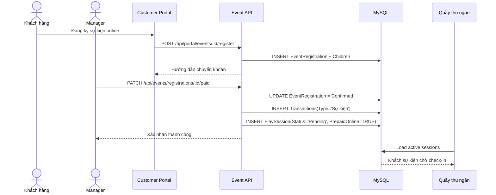

# Giao diện, triển khai logic và kiểm thử - TinkerBell Garden

## 7. Thiết kế giao diện người dùng (UI/UX)

### 7.1. Định hướng thiết kế giao diện

Giao diện của TinkerBell Garden được xây dựng bằng ReactJS kết hợp Vanilla CSS thuần. Dự án không sử dụng Tailwind CSS, Bootstrap, Material UI hay thư viện component UI bên ngoài. Việc tự viết CSS giúp hệ thống kiểm soát trực tiếp cấu trúc layout, màu sắc, spacing, responsive và trạng thái tương tác của từng màn hình.

Về phong cách thị giác, hệ thống chọn định hướng mềm mại, gần gũi với môi trường khu vui chơi trẻ em. Tông nền chủ đạo là xanh lá pastel, đặc biệt trong global style và các trang khách hàng. Màu nền như `#f0fdf4` hoặc các biến thể xanh nhạt giúp giao diện tạo cảm giác nhẹ nhàng, không gây căng mắt khi sử dụng trong thời gian dài. Các nút hành động chính thường dùng xanh lá đậm hơn để thống nhất nhận diện và tạo độ nổi bật.

Trang chủ được thiết kế theo phong cách cinematic với hero video tràn viền. Video sử dụng file tĩnh `/Animate_this_paper_cut_out_col.mp4` và được đặt các thuộc tính `autoPlay`, `loop`, `muted`, `playsInline` để tự động phát và lặp vô tận trên nhiều trình duyệt. CSS của hero video dùng `width: 100%`, `height: 70vh` và `object-fit: cover`, nhờ đó video luôn lấp đầy chiều ngang màn hình mà không bị méo hình. Phần bo góc chỉ áp dụng ở đáy hero bằng `border-bottom-left-radius` và `border-bottom-right-radius`, tạo cảm giác cinematic nhưng vẫn mềm mại.

Ngoài video, trang chủ có hai hiệu ứng chim bay ở rìa hero banner. Hai chú chim được dựng bằng HTML/CSS và animation keyframe `flyInOutLeft`, `flyInOutRight`. Chuyển động dùng `translateX`, `translateY` và `rotate` theo chu kỳ lặp vô tận để tạo cảm giác bay lượn. Các chi tiết trang trí như cây, lâu đài, hoa nền được đặt bằng CSS thuần, giúp giao diện giàu cảm xúc mà không cần thư viện animation ngoài.

### 7.2. Tư duy UX cho trang khách hàng

Luồng khách hàng được thiết kế theo hướng khám phá trước, hành động sau. Trang chủ hiển thị sự kiện trước mục khu vui chơi để khách dễ nhìn thấy các hoạt động đang mở đăng ký. Mỗi khu vui chơi được hiển thị dưới dạng card, có trạng thái vận hành, mô tả và ảnh nếu đã được upload. Khi click vào một khu, khách được chuyển sang trang chi tiết để xem hình ảnh, sức chứa, tình trạng và các dịch vụ tính phí liên quan.

Với hình ảnh khu vui chơi, dịch vụ và sản phẩm, hệ thống dùng lightbox tự viết bằng React Hook. Khi khách click vào ảnh, ảnh được phóng to ở giữa màn hình, phía sau là overlay tối mờ kết hợp `backdrop-filter: blur(4px)`. Cơ chế này giúp người dùng xem rõ hình ảnh mà không rời khỏi ngữ cảnh hiện tại.

Trang chi tiết dịch vụ sử dụng chính ảnh của dịch vụ làm background hero, kết hợp lớp phủ gradient màu đen để chữ vẫn đọc được. Cách trình bày này tạo sự liên kết trực quan giữa dịch vụ và danh sách sản phẩm bên dưới.

### 7.3. UX trong module Thu ngân

Module Thu ngân được thiết kế ưu tiên tốc độ thao tác và hạn chế sai sót. Thay vì tách quá nhiều màn hình, các nghiệp vụ cổng chính được gom trong màn hình `Ticketing.jsx`: tìm khách, tạo vé, chọn tab mua vé hoặc tham gia sự kiện, check-in, check-out và đăng ký/gia hạn VIP tại quầy.

Trong form bán vé, cashier có thể nhập username để tìm khách hàng. Nếu khách là VIP, giao diện hiển thị nhãn VIP để cashier nhận biết ưu đãi. Nếu khách không có tài khoản, cashier có thể nhập tên khách vãng lai. Điều này phù hợp với thực tế vận hành tại quầy, nơi không phải khách nào cũng có tài khoản trước.

Bảng bên phải được đổi thành "Quản lý khách ra/vào", thể hiện đúng bản chất nghiệp vụ hậu thanh toán. Mỗi dòng có trạng thái check-in rõ ràng. Nếu lượt chơi chưa bắt đầu, nút hành động là `Check-in`; nếu đang chơi, nút chuyển thành `Check-out`. Thiết kế hai trạng thái này giúp cashier không phải tự nhớ khách đang ở bước nào.

Tại modal check-out, hệ thống hiển thị chi tiết bill gồm tiền vé, dịch vụ phát sinh, phí lố giờ, giảm giá VIP và tổng cuối. Nếu tổng tiền bằng 0, ví dụ khách sự kiện đã thanh toán online và không dùng thêm dịch vụ, giao diện ẩn nút thanh toán và chỉ hiển thị nút xác nhận kết thúc. Nếu tổng tiền lớn hơn 0, giao diện hiển thị hai phương thức `Tiền mặt` và `Chuyển khoản`, trong đó chuyển khoản có QR để hỗ trợ thao tác nhanh tại quầy.

### 7.4. UX trong module POS dịch vụ

Module POS dịch vụ dành cho cashier khu vui chơi tập trung vào quy trình tìm sản phẩm và thêm vào bill. Cashier có thể tìm sản phẩm theo tên, click sản phẩm để đưa vào giỏ, tăng/giảm số lượng bằng bộ đếm và xóa khỏi giỏ nếu cần. Các thay đổi về số lượng được phản ánh ngay trên tổng tiền hiển thị.

Điểm quan trọng là POS nội bộ không chốt doanh thu ngay, mà ghi dịch vụ phát sinh vào lượt chơi đang mở. Điều này giúp trải nghiệm tại quầy bên trong nhanh hơn: cashier không phải xử lý thanh toán nhiều lần, khách thanh toán một lần duy nhất khi ra cổng.

### 7.5. UX trong module Thống kê

Dashboard báo cáo được thiết kế theo tư duy vận hành: Manager cần nhìn được dữ liệu theo nhiều lát cắt nhưng không muốn chờ tải lại trang liên tục. Vì vậy, màn hình `ReportDashboard.jsx` tải raw data một lần từ `/api/reports/dashboard`, sau đó dùng bộ lọc realtime ở client.

Các bộ lọc toàn cục gồm:

- Từ ngày, đến ngày.
- Tìm kiếm khách hàng.
- Phương thức thanh toán.
- Loại vé.
- Sản phẩm.
- Khu vui chơi.

Dữ liệu sau lọc được áp dụng đồng thời cho nhiều bảng lịch sử và bảng tổng hợp doanh thu. Mỗi bảng có dòng tổng ở cuối bằng `tfoot`, giúp Manager dễ đối soát số lượng và doanh thu ngay trong cùng ngữ cảnh dữ liệu.

Dashboard sử dụng các card/bảng rõ ràng thay vì hiệu ứng trang trí phức tạp. Đây là lựa chọn phù hợp với màn hình nghiệp vụ, nơi khả năng đọc, lọc và kiểm tra số liệu quan trọng hơn yếu tố biểu diễn.

## 8. Triển khai các thành phần

### 8.1. Thuật toán tính tiền check-out linh động

Nghiệp vụ check-out được triển khai ở backend trong module ticket. Hệ thống tính bill dựa trên nhiều nguồn dữ liệu: loại vé, số lượng khách, dịch vụ phát sinh, trạng thái VIP, thời gian check-in/check-out và trạng thái sự kiện đã thanh toán online.

Các thành phần chi phí chính:

```text
Tổng trước giảm = Tiền vé + Tiền dịch vụ phát sinh + Phí lố giờ
Giảm VIP = 20% * Tổng trước giảm nếu khách là VIP còn hạn
Tổng cuối = Tổng trước giảm - Giảm VIP
```

Trong đó:

- Tiền vé được lấy từ `TicketType.BasePrice` hoặc `EventCampaign.TicketPrice`.
- Nếu lượt chơi là sự kiện đã thanh toán online (`Purpose = Event` và `PrepaidOnline = TRUE`) thì tiền vé bằng 0.
- Tiền dịch vụ phát sinh được lấy từ tổng `SessionService.LineTotal` theo `SessionID`.
- Phí lố giờ chỉ áp dụng khi vé có giới hạn thời gian.

Logic phí lố giờ:

```text
Nếu vé không giới hạn trong ngày:
  Phí lố giờ = 0

Nếu vé giới hạn 2 giờ:
  Nếu tổng phút chơi <= 120:
    Phí lố giờ = 0
  Nếu tổng phút chơi > 120:
    Số phút lố = Tổng phút chơi - 120
    Số block phạt = ceil(Số phút lố / 30)
    Phí lố giờ gốc = Số block phạt * 50.000
```

Sau khi tính tổng tiền, backend tạo snapshot hóa đơn trong `TicketInvoice` và ghi doanh thu vào `Transactions`. Tùy từng phần của bill, hệ thống có thể sinh các transaction theo loại khác nhau như `Vé vào cửa`, `Dịch vụ lẻ`, `Phạt lố giờ`. Việc phân tách transaction theo loại giúp dashboard thống kê chính xác từng nguồn doanh thu.

### 8.2. Luồng hậu thanh toán từ tạo vé đến chốt bill

Luồng hậu thanh toán được triển khai thành các bước rõ ràng:

1. Cashier tạo vé bằng `POST /api/tickets/sessions`.
2. Backend tạo `PlaySession` với `Status = Pending`, chưa ghi doanh thu.
3. Cashier bấm check-in bằng `PATCH /api/tickets/sessions/:id/checkin`.
4. Backend cập nhật `CheckinTime` và `Status = Playing`.
5. Cashier khu vui chơi thêm dịch vụ phát sinh bằng `POST /api/tickets/service-orders`.
6. Backend ghi `SessionService` và trừ `Product.Stock`.
7. Cashier cổng xem trước bill bằng `GET /api/tickets/sessions/:id/checkout-preview`.
8. Cashier xác nhận thanh toán bằng `POST /api/tickets/sessions/:id/checkout`.
9. Backend cập nhật `PlaySession`, tạo `TicketInvoice` và ghi `Transactions`.

Thiết kế này giúp hệ thống tránh ghi doanh thu sớm. Doanh thu chỉ xuất hiện khi khách thực sự check-out và thanh toán.

### 8.3. Data hook từ sự kiện sang quầy thu ngân

Một trong các logic quan trọng của hệ thống là liên kết module sự kiện online với quầy thu ngân cổng. Khi khách đăng ký sự kiện online, hệ thống tạo `EventRegistration` và danh sách `EventRegistrationChild`, trạng thái ban đầu là chờ chuyển khoản hoặc đã gửi yêu cầu chuyển khoản.

Ở giao diện Manager, bảng "Danh sách đăng ký online tham dự sự kiện" có checkbox xác nhận đã thanh toán. Khi Manager tick checkbox này, frontend gọi:

```http
PATCH /api/events/registrations/:id/paid
```

Backend thực hiện đồng thời các bước:

- Cập nhật trạng thái `EventRegistration` sang `Confirmed`.
- Cập nhật `PaidAt`.
- Tạo một transaction loại `Sự kiện` trong `Transactions`.
- Tạo một `PlaySession` trạng thái `Pending` với `Purpose = Event`.
- Đặt `PrepaidOnline = TRUE` để cashier cổng biết vé sự kiện đã thanh toán online.

Nhờ data hook này, dữ liệu không bị đứt đoạn giữa online và offline. Khi khách đến cổng, cashier chỉ cần mở bảng quản lý khách ra/vào, tìm lượt chờ check-in và bấm `Check-in`. Khi khách check-out, tiền vé sự kiện được tính là 0 vì đã được thanh toán online.



### 8.4. Tính toán dashboard ở client-side

Dashboard sử dụng API `/api/reports/dashboard` để lấy một bộ dữ liệu tổng gồm:

- Danh sách loại vé.
- Danh sách khu vui chơi.
- Lịch sử thanh toán cổng vào.
- Lịch sử thanh toán dịch vụ.
- Lịch sử lượt chơi và phí lố giờ.
- Giao dịch VIP.
- Giao dịch sự kiện.

Sau khi nhận dữ liệu, `ReportDashboard.jsx` sử dụng `useMemo`, `filter`, `reduce` và `Set` để xử lý lọc chéo. Ví dụ khi Manager lọc theo sản phẩm hoặc khu vui chơi, dashboard lấy danh sách `sessionId` phù hợp từ bảng dịch vụ, sau đó áp dụng sang bảng thanh toán cổng và lịch sử lượt chơi. Cách này giúp các bảng không bị rời rạc khi sử dụng nhiều bộ lọc cùng lúc.

Các phép tính tổng được thực hiện bằng `reduce`, ví dụ tổng số lượng vé, tổng doanh thu cổng vào, tổng doanh thu dịch vụ, tổng phí lố giờ, tổng doanh thu VIP và sự kiện. Vì các phép tính được bọc trong `useMemo`, React chỉ tính lại khi dữ liệu hoặc bộ lọc thay đổi, tránh render lại không cần thiết.

Ưu điểm của cách tiếp cận này:

- Trải nghiệm lọc realtime, không cần gọi API liên tục.
- Dễ kiểm tra logic tổng ở client vì dữ liệu đầu vào rõ ràng.
- Phù hợp với quy mô dữ liệu vừa phải trong phạm vi đồ án.

Hạn chế là khi dữ liệu tăng rất lớn, client-side filtering có thể gây nặng trình duyệt. Khi triển khai production quy mô lớn, có thể chuyển một phần filter/pagination xuống backend.

### 8.5. Upload ảnh và hiển thị media

Admin có thể upload ảnh khu vui chơi, dịch vụ và sản phẩm. Backend dùng Multer để nhận file và lưu vào `server/public/uploads`. Express cấu hình:

```js
app.use('/uploads', express.static(path.join(__dirname, '../public/uploads')))
```

Sau khi upload, backend cập nhật đường dẫn ảnh vào các cột tương ứng:

- `Facility.ImageURL`
- `PaidService.ImageURL`
- `Product.ImageURL`

Frontend dùng URL `/uploads/...` để hiển thị ảnh ở trang quản trị và trang khách hàng. Với sản phẩm hoặc dịch vụ, nếu admin không upload ảnh mới khi cập nhật, backend giữ nguyên `ImageURL` cũ, tránh lỗi ghi đè bằng `null`.

### 8.6. Quản lý VIP và áp dụng ưu đãi

VIP được quản lý thông qua trạng thái `Customer.IsVIP` và `Customer.VIPExpiryDate`. Khi cashier hoặc customer đăng ký/gia hạn, hệ thống cập nhật hạn VIP và ghi nhận giao dịch liên quan. Tại checkout, backend kiểm tra khách có VIP còn hạn hay không. Nếu có, hệ thống áp dụng giảm 20% lên tổng bill trước giảm.

Thiết kế này giúp ưu đãi VIP được áp dụng nhất quán ở backend, tránh phụ thuộc hoàn toàn vào giao diện.

## 10. Kiểm thử và đánh giá

### 10.1. Phạm vi kiểm thử

Các kịch bản kiểm thử tập trung vào những điểm dễ sai logic nhất của hệ thống: trạng thái check-in/check-out, tính tiền hậu thanh toán, phí lố giờ, VIP, sự kiện online, POS dịch vụ và dashboard. Ngoài ra, giao diện cũng được kiểm tra ở desktop và kích thước màn hình nhỏ hơn để đảm bảo responsive cơ bản.

### 10.2. Bảng test case nghiệp vụ

| Mã test | Kịch bản | Dữ liệu kiểm thử | Kết quả mong đợi |
| --- | --- | --- | --- |
| TC-01 | Tạo vé thường hậu thanh toán | Khách vãng lai, vé 2 giờ, số lượng 1 | Hệ thống tạo `PlaySession` trạng thái `Pending`, chưa tạo `Transactions`. |
| TC-02 | Check-in lượt chơi | Lượt chơi đang `Pending` | Sau khi bấm `Check-in`, `CheckinTime` có giá trị và trạng thái chuyển sang `Playing`. |
| TC-03 | Check-out vé 2 giờ không lố giờ | Tổng thời gian chơi <= 120 phút | Phí lố giờ = 0, bill chỉ gồm tiền vé và dịch vụ phát sinh nếu có. |
| TC-04 | Check-out vé 2 giờ có lố giờ | Tổng thời gian chơi 151 phút | Số phút lố = 31, block phạt = 2, phí phạt gốc = 100.000 đồng. |
| TC-05 | Check-out khách VIP có lố giờ | Khách VIP còn hạn, tổng bill trước giảm > 0 | Hệ thống giảm 20% tổng bill và hiển thị số tiền cuối sau giảm. |
| TC-06 | Vé không giới hạn trong ngày | Loại vé có `TimeLimit = NULL` | Không phát sinh phí lố giờ dù thời gian chơi vượt 120 phút. |
| TC-07 | Khách sự kiện đã thanh toán online | `Purpose = Event`, `PrepaidOnline = TRUE` | Tiền vé tại checkout = 0, hiển thị logic đã thanh toán online. |
| TC-08 | Khách sự kiện đã thanh toán online không dùng dịch vụ | Tổng tiền cuối = 0 | Modal checkout ẩn nút `Tiền mặt` và `Chuyển khoản`, chỉ hiện nút xác nhận kết thúc. |
| TC-09 | POS dịch vụ phát sinh | Khách đang `Playing`, thêm 2 sản phẩm vào giỏ | Hệ thống ghi `SessionService`, trừ tồn kho sản phẩm, chưa tạo doanh thu ngay. |
| TC-10 | Dịch vụ phát sinh xuất hiện ở checkout | Lượt chơi có `SessionService` | Bill checkout hiển thị tiền dịch vụ phát sinh và cộng vào tổng cuối. |
| TC-11 | Manager xác nhận thanh toán sự kiện online | Tick checkbox đã thanh toán ở bảng đăng ký online | Backend tạo transaction sự kiện và tạo `PlaySession` trạng thái `Pending` cho quầy cổng. |
| TC-12 | Dashboard lọc theo phương thức thanh toán | Chọn `Tiền mặt` hoặc `Chuyển khoản` | Các bảng lịch sử và dòng tổng chỉ tính dữ liệu theo phương thức đã chọn. |
| TC-13 | Dashboard lọc theo sản phẩm và khu vui chơi | Nhập tên sản phẩm hoặc chọn khu | Bảng dịch vụ, bảng cổng và lịch sử lượt chơi được lọc chéo theo `sessionId` liên quan. |
| TC-14 | Upload ảnh khu vui chơi | Admin chọn file ảnh hợp lệ | File được lưu vào `/uploads`, `Facility.ImageURL` được cập nhật và khách hàng xem được ảnh. |
| TC-15 | Cập nhật sản phẩm không chọn ảnh mới | PUT sản phẩm không gửi file | Backend giữ nguyên `Product.ImageURL` cũ, không ghi đè `null`. |

### 10.3. Test case giao diện và responsive

| Mã test | Kịch bản | Kết quả mong đợi |
| --- | --- | --- |
| UI-01 | Mở trang chủ trên desktop | Hero video tràn ngang, tự động phát, lặp vô tận, không méo hình. |
| UI-02 | Mở trang chủ trên mobile | Video vẫn cover khung, card sự kiện/khu vui chơi xuống dòng hợp lý. |
| UI-03 | Hover/click ảnh khu vui chơi | Lightbox mở ở giữa màn hình, overlay tối mờ, click nền hoặc nút đóng thì thoát. |
| UI-04 | Mở màn hình thu ngân | Form bán vé và bảng quản lý khách ra/vào hiển thị rõ, không lẫn nút thanh toán đầu vào. |
| UI-05 | Mở dashboard trên màn hình nhỏ | Bộ lọc và bảng vẫn đọc được, có vùng cuộn ngang cho bảng nhiều cột nếu cần. |

### 10.4. Đánh giá ưu điểm

Hệ thống có các ưu điểm chính sau:

- Mô hình hậu thanh toán được triển khai rõ ràng, tách biệt tạo vé, check-in và thanh toán cuối phiên.
- Dịch vụ phát sinh trong khu vui chơi được nối vào bill checkout, giúp giảm rủi ro thất thoát doanh thu.
- Logic phí lố giờ được xử lý tập trung ở backend, hạn chế sai lệch do client tự tính.
- Sự kiện online có data hook sang quầy cổng, giúp đồng bộ dữ liệu online và offline.
- Dashboard có khả năng lọc realtime, tổng hợp doanh thu theo nhiều nguồn: vé, dịch vụ, phí lố giờ, VIP, sự kiện.
- Giao diện dùng Vanilla CSS nên không phụ thuộc thư viện UI, dễ tùy biến và phù hợp yêu cầu đồ án.
- Upload ảnh được tích hợp cho khu vui chơi, dịch vụ và sản phẩm, giúp trang khách hàng trực quan hơn.
- Phân quyền Manager/Cashier/Customer và lọc dữ liệu theo phạm vi cashier đã được xử lý ở backend.

### 10.5. Hạn chế hiện tại

Bên cạnh các chức năng đã hoàn thiện, hệ thống vẫn còn một số hạn chế:

- Dashboard hiện xử lý lọc chủ yếu ở client-side. Với dữ liệu lớn, cần bổ sung server-side pagination, index tối ưu và query filter theo điều kiện.
- Chưa tích hợp cổng thanh toán thật. Các luồng chuyển khoản hiện dùng QR và xác nhận thủ công.
- Chưa có bộ test tự động đầy đủ cho unit test, integration test và end-to-end test.
- Upload ảnh chưa có bước xử lý tối ưu dung lượng, resize ảnh hoặc kiểm duyệt nội dung.
- Chưa có audit log chi tiết để ghi lại từng thao tác nhạy cảm của Manager/Cashier.
- Chưa có phân hệ quản lý ca làm và đối soát cuối ca theo từng cashier.

### 10.6. Hướng phát triển tiếp theo

Các hướng phát triển phù hợp nếu mở rộng hệ thống:

- Bổ sung kiểm thử tự động bằng unit test cho service tính bill và integration test cho API checkout.
- Thêm server-side pagination và filter cho dashboard khi dữ liệu tăng.
- Tích hợp cổng thanh toán hoặc webhook ngân hàng để tự động xác nhận chuyển khoản.
- Thêm audit log cho các thao tác: xóa sự kiện, xác nhận thanh toán, checkout, gia hạn VIP.
- Xây dựng module quản lý ca làm, đối soát tiền mặt và chuyển khoản theo cashier.
- Tối ưu upload ảnh bằng nén ảnh, resize và giới hạn loại file.
- Bổ sung phân tích doanh thu nâng cao theo giờ cao điểm, khu vui chơi, sản phẩm bán chạy và tần suất khách VIP.
