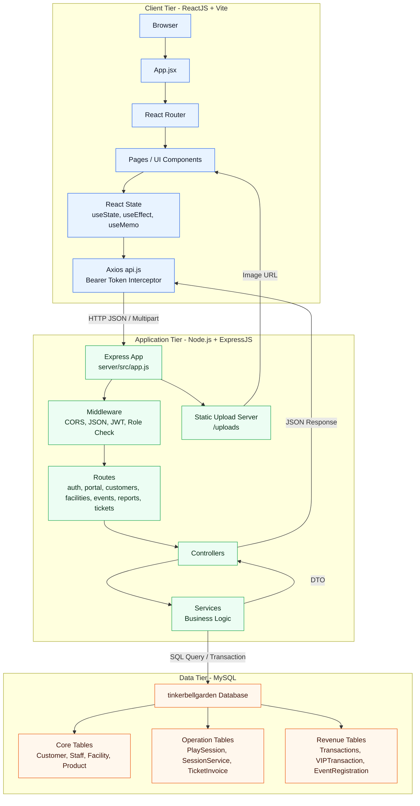
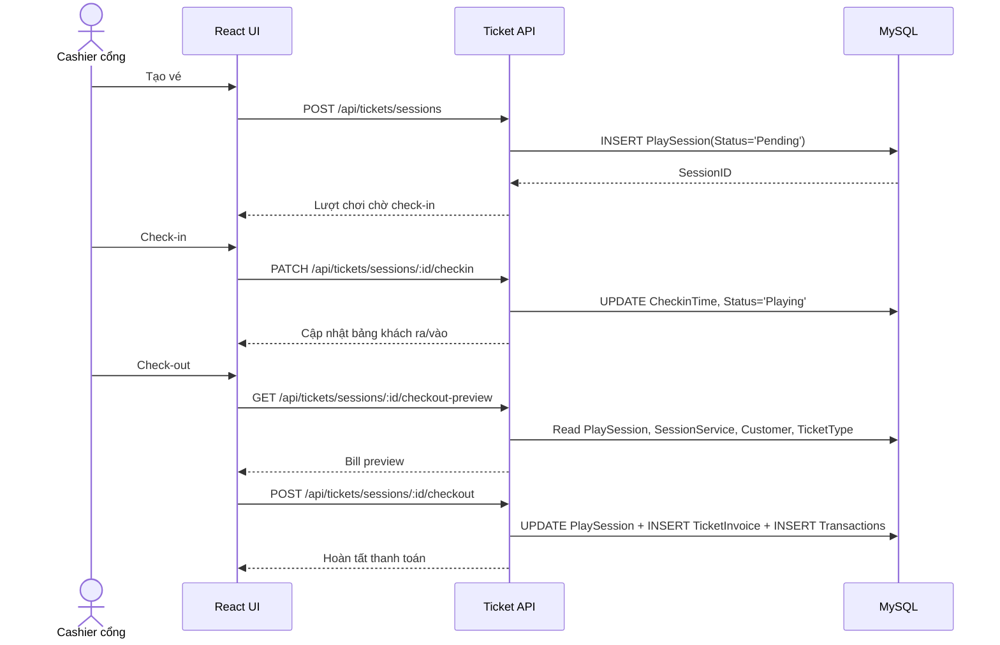
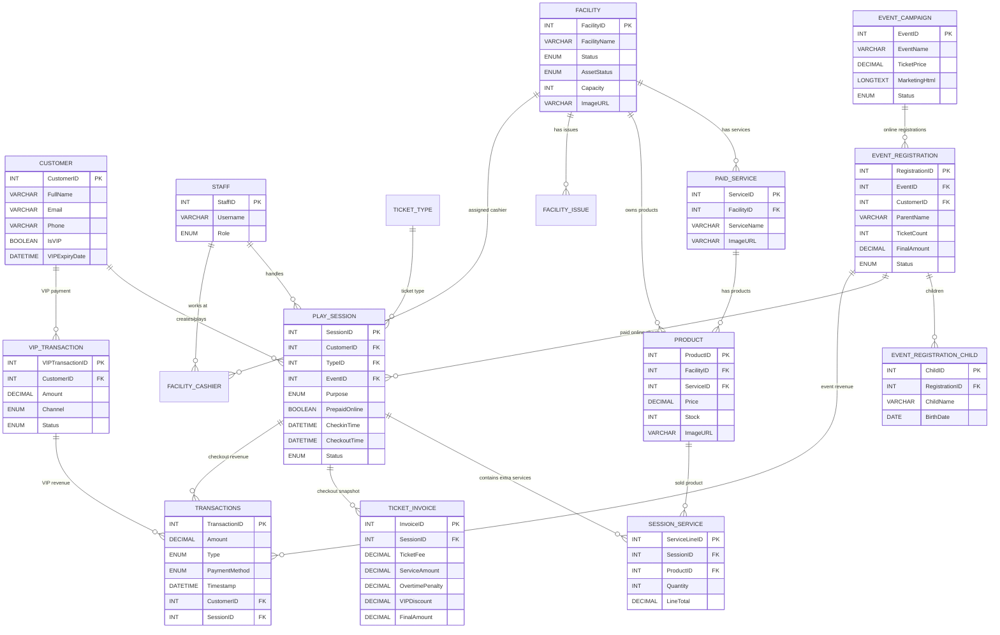

# Thiết kế hệ thống, cơ sở dữ liệu và API - TinkerBell Garden

## 4. Kiến trúc hệ thống

### 4.1. Kiến trúc tổng thể

Hệ thống TinkerBell Garden được xây dựng theo mô hình Client-Server kết hợp kiến trúc 3 lớp. Mỗi lớp đảm nhiệm một nhóm trách nhiệm riêng biệt nhằm tách phần giao diện, xử lý nghiệp vụ và lưu trữ dữ liệu.

Lớp trình bày được triển khai bằng ReactJS và Vite. Frontend chịu trách nhiệm hiển thị giao diện theo vai trò người dùng, quản lý trạng thái màn hình, điều hướng trang và gọi API. Lớp nghiệp vụ được triển khai bằng Node.js và ExpressJS. Backend tiếp nhận HTTP request, xác thực JWT, kiểm tra phân quyền, điều phối route/controller/service và xử lý các nghiệp vụ quan trọng như check-in, check-out, tính tiền hậu thanh toán, xác nhận thanh toán sự kiện và tổng hợp dữ liệu báo cáo. Lớp dữ liệu sử dụng MySQL, truy cập thông qua `mysql2/promise`, lưu các bảng nghiệp vụ như khách hàng, nhân viên, khu vui chơi, dịch vụ tính phí, sự kiện, lượt chơi và giao dịch doanh thu.

Về mặt tổ chức code, backend được chia theo module nghiệp vụ trong thư mục `server/src/modules`, ví dụ `auth`, `customer`, `facility`, `ticket`, `event`, `portal`, `report`, `transaction`. Cách tổ chức này gần với mô hình MVC mở rộng: route nhận request, controller chuẩn hóa input/output, service xử lý nghiệp vụ và model/schema nằm ở tầng database.



### 4.2. Công nghệ sử dụng

| Lớp | Công nghệ | Vai trò |
| --- | --- | --- |
| Frontend | ReactJS, Vite | Xây dựng SPA, render giao diện theo vai trò, điều hướng bằng React Router. |
| Frontend API | Axios | Chuẩn hóa gọi API, tự động gắn JWT từ `localStorage` thông qua interceptor. |
| Frontend State | React Hooks | Quản lý form, modal, danh sách dữ liệu, bộ lọc dashboard, trạng thái giỏ hàng POS. |
| Backend | Node.js, ExpressJS | Xây dựng REST API, middleware xác thực, route/controller/service. |
| Database | MySQL, `mysql2/promise` | Lưu dữ liệu nghiệp vụ, thực hiện query bất đồng bộ và transaction khi cần. |
| Upload | Multer, `express.static` | Nhận file ảnh khu vui chơi, dịch vụ, sản phẩm và serve lại qua `/uploads`. |
| Dev/Deploy | Docker Compose | Dựng môi trường gồm database, backend và frontend. |

### 4.3. Luồng xử lý nghiệp vụ hậu thanh toán

Điểm cốt lõi của hệ thống là luồng hậu thanh toán. Khi khách mua vé tại cổng, backend chưa tạo doanh thu ngay mà chỉ sinh bản ghi `PlaySession` ở trạng thái `Pending`. Khi khách vào cổng, cashier bấm check-in để cập nhật `CheckinTime` và chuyển trạng thái sang `Playing`. Trong quá trình chơi, nếu khách sử dụng dịch vụ tại các khu, POS nội bộ ghi các dòng phát sinh vào `SessionService`. Khi khách ra về, cashier thực hiện check-out, backend tính tổng tiền dựa trên tiền vé, dịch vụ phát sinh, phí lố giờ và ưu đãi VIP, sau đó mới tạo `TicketInvoice` và ghi các dòng doanh thu vào `Transactions`.



Luồng này giúp hệ thống phản ánh đúng trạng thái thực tế: khách đã có vé, khách đã vào chơi và khách đã thanh toán là ba trạng thái khác nhau. Việc tách trạng thái như vậy giúp hạn chế thất thoát doanh thu và hỗ trợ truy vết khi cần đối soát.

### 4.4. Phân quyền và bảo vệ API

Backend sử dụng middleware xác thực JWT trong `server/src/middlewares/auth.js`. Người dùng sau khi đăng nhập được cấp token, frontend lưu token trong `localStorage` và `client/src/services/api.js` tự động gắn header `Authorization: Bearer <token>` khi gọi API.

Hệ thống phân biệt ba nhóm quyền chính:

- `Manager`: truy cập các chức năng quản trị như khu vui chơi, dịch vụ, sự kiện, VIP, dashboard, phân công cashier.
- `Cashier`: thao tác nghiệp vụ thu ngân; phạm vi hiển thị phụ thuộc phân công cổng hoặc khu vui chơi.
- `Customer`: truy cập portal khách hàng, đăng ký sự kiện, đăng ký VIP và xem thông tin cá nhân.

Phân quyền không chỉ dừng ở kiểm tra role mà còn kiểm tra phạm vi dữ liệu. Ví dụ Cashier khu vui chơi chỉ nhìn thấy sản phẩm thuộc khu được phân công; Cashier cổng mới được thao tác luồng tạo vé, check-in và check-out.

## 5. Thiết kế kiến trúc thành phần

### 5.1. Tổ chức frontend theo layout

Frontend được tổ chức quanh `App.jsx`. Component này chịu trách nhiệm đọc session từ `localStorage`, xác định người dùng hiện tại là staff, customer hay public visitor, sau đó render layout tương ứng. Mặc dù trong code không đặt tên file riêng là `AdminLayout`, `CashierLayout`, `CustomerLayout`, cấu trúc thực tế vẫn thể hiện ba layout chức năng rõ ràng:

- `StaffWorkspace`: workspace dùng chung cho nhân viên, hiển thị sidebar và nội dung nghiệp vụ.
- Manager view: tương đương `AdminLayout`, cho phép truy cập đầy đủ các tab quản trị.
- Cashier view: tương đương `CashierLayout`, tự điều chỉnh menu theo phân công Gate hoặc Facility.
- Customer portal: tương đương `CustomerLayout`, dùng React Router để điều hướng trang chủ, chi tiết khu vui chơi, chi tiết dịch vụ, chi tiết sự kiện và VIP.

Danh sách màn hình staff được khai báo tập trung trong mảng `staffViews` của `App.jsx`. Cách thiết kế này giúp hệ thống dễ thêm/bớt module, đồng thời dùng chung cơ chế sidebar, active tab và logout.

```mermaid
graph TD
  Root["main.jsx"] --> App["App.jsx"]
  App --> AuthGateway["AuthGateway<br/>Login / Register"]
  App --> StaffWorkspace["StaffWorkspace"]
  App --> CustomerRoutes["Customer Portal Routes"]

  StaffWorkspace --> ManagerViews["Manager Layout"]
  StaffWorkspace --> GateCashierViews["Gate Cashier Layout"]
  StaffWorkspace --> FacilityCashierViews["Facility Cashier Layout"]

  ManagerViews --> Ticketing["Ticketing.jsx"]
  ManagerViews --> ServicePOS["ServicePOS.jsx"]
  ManagerViews --> VipManager["VipManager.jsx"]
  ManagerViews --> BookingsList["BookingsList.jsx"]
  ManagerViews --> GamesManager["GamesManager.jsx"]
  ManagerViews --> Services["Services.jsx"]
  ManagerViews --> EventCampaigns["EventCampaigns.jsx"]
  ManagerViews --> ReportDashboard["ReportDashboard.jsx"]

  GateCashierViews --> GateTicketing["Ticketing.jsx<br/>Create Ticket / Check-in / Check-out"]

  FacilityCashierViews --> MyFacility["GamesManager.jsx<br/>Khu của tôi"]
  FacilityCashierViews --> MyServices["Services.jsx<br/>Dịch vụ tính phí"]
  FacilityCashierViews --> MyPOS["ServicePOS.jsx<br/>POS khu vui chơi"]

  CustomerRoutes --> HomePage["HomePage.jsx"]
  CustomerRoutes --> CustomerFacilities["CustomerFacilities.jsx"]
  CustomerRoutes --> ServiceProducts["ServiceProducts.jsx"]
  CustomerRoutes --> EventDetail["EventDetail.jsx"]
  CustomerRoutes --> VipMembership["VipMembership.jsx"]

  classDef app fill:#eef2ff,stroke:#4f46e5,color:#111827;
  classDef staff fill:#ecfdf3,stroke:#16a34a,color:#052e16;
  classDef customer fill:#fff7ed,stroke:#ea580c,color:#431407;
  class Root,App,AuthGateway app;
  class StaffWorkspace,ManagerViews,GateCashierViews,FacilityCashierViews,Ticketing,ServicePOS,VipManager,BookingsList,GamesManager,Services,EventCampaigns,ReportDashboard,GateTicketing,MyFacility,MyServices,MyPOS staff;
  class CustomerRoutes,HomePage,CustomerFacilities,ServiceProducts,EventDetail,VipMembership customer;
```



### 5.2. Nhóm component quản trị

Nhóm quản trị gồm các màn hình dành cho Manager:

- `GamesManager.jsx`: quản lý khu vui chơi, trạng thái vận hành, CSVC, sức chứa, cashier phụ trách và hình ảnh.
- `Services.jsx`: quản lý dịch vụ tính phí theo mô hình khu vui chơi, dịch vụ, sản phẩm; hỗ trợ upload ảnh dịch vụ/sản phẩm.
- `EventCampaigns.jsx`: tạo/sửa/xóa sự kiện, soạn nội dung marketing, xem danh sách đăng ký online và xác nhận thanh toán.
- `BookingsList.jsx`: quản lý booking sự kiện.
- `VipManager.jsx`: xem danh sách khách VIP, tìm kiếm và gia hạn tại quầy.
- `ReportDashboard.jsx`: dashboard báo cáo doanh thu với các bộ lọc và bảng tổng hợp.

Các màn hình này dùng chung mô hình form bên trái, bảng bên phải, modal xác nhận, request API qua service `request()` và trạng thái loading/error cục bộ bằng React Hooks.

### 5.3. Nhóm component thu ngân

Nhóm thu ngân tập trung vào tốc độ thao tác tại quầy:

- `Ticketing.jsx`: tạo vé hậu thanh toán, check-in, check-out, chọn sự kiện đang diễn ra và thanh toán cuối phiên.
- `ServicePOS.jsx`: tìm sản phẩm, quản lý giỏ hàng, xác nhận dịch vụ phát sinh vào lượt chơi.
- `PaymentModal.jsx`: modal thanh toán dùng lại cho tiền mặt/chuyển khoản và hiển thị QR.
- `VipManager.jsx`: đăng ký/gia hạn VIP tại quầy.

Thiết kế POS ưu tiên thao tác ít bước: tìm sản phẩm, thêm vào giỏ, chỉnh số lượng, xác nhận. Tổng tiền hoặc trạng thái bill được tính lại ngay trên client để cashier thấy phản hồi tức thì, nhưng dữ liệu cuối cùng vẫn được backend kiểm tra khi ghi nhận.

### 5.4. Nhóm component khách hàng

Nhóm customer portal phục vụ trải nghiệm công khai:

- `HomePage.jsx`: hero video, danh sách sự kiện và danh sách khu vui chơi.
- `CustomerFacilities.jsx`: chi tiết khu vui chơi, hình ảnh, mô tả, sức chứa, tình trạng và dịch vụ tính phí liên quan.
- `ServiceProducts.jsx`: chi tiết dịch vụ, ảnh nền động theo dịch vụ và danh sách sản phẩm.
- `EventDetail.jsx`: render nội dung marketing HTML và luồng đăng ký online.
- `VipMembership.jsx`: hiển thị trạng thái VIP, đăng ký/gia hạn VIP.
- `ImageLightbox.jsx`: phóng to ảnh khu vui chơi, dịch vụ hoặc sản phẩm bằng state nội bộ.

Các component này dùng React Router để điều hướng theo route như `/facility/:id`, `/service/:serviceId`, `/events/:id`, `/vip`.

### 5.5. Quản lý state và tái sử dụng

State trong frontend được quản lý chủ yếu bằng React Hooks:

- `useState`: quản lý form input, modal, tab, giỏ hàng POS, dữ liệu đã load.
- `useEffect`: gọi API khi component mount hoặc khi dependency thay đổi, ví dụ load danh sách sự kiện đang diễn ra.
- `useMemo`: tối ưu các phép tính lọc và tổng hợp dữ liệu dashboard.
- `localStorage`: lưu session staff/customer, token và active role.

`client/src/services/api.js` đóng vai trò API wrapper dùng chung. File này tạo Axios instance với `baseURL` là `/api` hoặc biến môi trường `VITE_API_URL`, đồng thời gắn token từ `localStorage` vào header. Cách làm này giúp component không phải tự xử lý lặp lại logic xác thực khi gọi API.

Tính tái sử dụng thể hiện rõ ở các nhóm component và pattern:

- Modal thanh toán được dùng lại cho check-out, POS và VIP.
- Lightbox ảnh được dùng lại ở trang khu vui chơi, dịch vụ và sản phẩm.
- Pattern form/bảng được dùng trong quản lý khu vui chơi, dịch vụ tính phí, sự kiện và VIP.
- Dashboard tái sử dụng một nguồn raw data từ API rồi xử lý filter/tổng hợp ở client.

## 6. Thiết kế cơ sở dữ liệu

### 6.1. Tổng quan thiết kế dữ liệu

Database MySQL được thiết kế xoay quanh các nhóm dữ liệu chính:

- Nhóm người dùng và phân quyền: `Staff`, `Customer`, `StaffAreaAssignment`, `FacilityCashier`.
- Nhóm khu vui chơi và dịch vụ: `Facility`, `FacilityIssue`, `PaidService`, `Product`.
- Nhóm vận hành vé và hậu thanh toán: `TicketType`, `PlaySession`, `SessionService`, `TicketInvoice`.
- Nhóm sự kiện: `EventCampaign`, `EventRegistration`, `EventRegistrationChild`, `EventBooking`.
- Nhóm doanh thu: `Transactions`, `VIPTransaction`, `VipPaymentRequest`.

Trong đó, `PlaySession` và `Transactions` là hai bảng trung tâm của mô hình vận hành. `PlaySession` phản ánh trạng thái khách ra/vào và dữ liệu phát sinh trong quá trình chơi. `Transactions` phản ánh doanh thu sau khi tiền đã được xác nhận.



### 6.2. Bảng khách hàng và nhân viên

Bảng `Customer` lưu thông tin khách hàng gồm họ tên, email, số điện thoại, mật khẩu hash, trạng thái VIP, hạn VIP, giờ tích lũy và điểm thành viên. Các trường `IsVIP` và `VIPExpiryDate` được sử dụng trong các nghiệp vụ giảm giá, đặc biệt là checkout và đăng ký sự kiện.

Bảng `Staff` lưu tài khoản nhân viên với role `Manager` hoặc `Cashier`. Việc phân công cashier được tách thành hai bảng. `StaffAreaAssignment` lưu cashier đang phụ trách cổng hoặc một khu cụ thể. `FacilityCashier` biểu diễn quan hệ nhiều-nhiều giữa khu vui chơi và cashier, cho phép một khu có nhiều cashier và một cashier có thể được gán theo phạm vi nghiệp vụ.

Thiết kế này giúp backend lọc dữ liệu theo quyền. Manager nhìn thấy toàn bộ dữ liệu, còn Cashier chỉ thấy khu, sản phẩm hoặc màn hình phù hợp với phân công.

### 6.3. Bảng khu vui chơi, dịch vụ và sản phẩm

Bảng `Facility` là bảng gốc cho danh mục khu vui chơi. Bảng này lưu tên khu, mô tả, trạng thái vận hành, trạng thái CSVC, sức chứa và đường dẫn ảnh `ImageURL`. Các vấn đề CSVC được tách sang `FacilityIssue` để lưu nhiều vấn đề cho cùng một khu và đánh dấu vấn đề đã được xử lý.

Dịch vụ tính phí được thiết kế theo ba tầng:

```text
Facility -> PaidService -> Product
```

`PaidService` đại diện cho nhóm dịch vụ thuộc một khu, ví dụ dịch vụ tô tượng tại Góc sáng tạo. `Product` đại diện cho từng hạng mục có giá và tồn kho cụ thể, ví dụ tô tượng size nhỏ, tranh tô màu, vé game. `Product` có `FacilityID`, `ServiceID`, `Price`, `Stock`, `ImageURL` và `Active`.

Cách thiết kế ba tầng này đáp ứng hai nhu cầu. Thứ nhất, giao diện khách hàng có thể xem dịch vụ theo từng khu và xem sản phẩm theo từng dịch vụ. Thứ hai, POS cashier có thể lọc sản phẩm theo khu được phân công và cập nhật tồn kho khi bán.

### 6.4. Bảng lượt chơi và hậu thanh toán

Bảng `PlaySession` lưu một lượt ra/vào của khách. Đây là bảng lõi của hệ thống hậu thanh toán. Mỗi record có thể liên kết với `Customer`, `TicketType`, `EventCampaign`, `EventRegistration` và `Staff`. Trường `Status` biểu diễn vòng đời của lượt chơi: `Pending`, `Playing`, `Completed`, `Cancelled`.

Các trường quan trọng của `PlaySession`:

- `Purpose`: phân biệt lượt chơi thường và lượt tham gia sự kiện.
- `PrepaidOnline`: đánh dấu vé sự kiện đã thanh toán online, giúp checkout biết tiền vé bằng 0.
- `CheckinTime`: thời điểm khách vào cổng.
- `CheckoutTime`: thời điểm khách ra về.
- `ChildrenCount`, `AdultsCount`: số lượng người tham gia.
- `PaidAmount`: tổng tiền đã chốt sau checkout.

Bảng `SessionService` lưu các sản phẩm/dịch vụ phát sinh trong thời gian khách đang chơi. Mỗi dòng gồm `SessionID`, `ProductID`, `Quantity`, `UnitPrice`, `LineTotal`. Khi cashier khu vui chơi bán sản phẩm, hệ thống không tạo doanh thu ngay mà ghi dòng vào `SessionService`. Đến checkout, backend cộng toàn bộ `LineTotal` vào bill.

Bảng `TicketInvoice` lưu snapshot hóa đơn tại thời điểm checkout, gồm tiền vé, tiền dịch vụ, phí quá giờ, giảm giá VIP và số tiền cuối cùng. Snapshot này giúp hệ thống giữ lại trạng thái tính toán tại thời điểm thanh toán, kể cả khi sau này giá vé hoặc giá sản phẩm thay đổi.

### 6.5. Bảng giao dịch doanh thu

`Transactions` là bảng sổ cái doanh thu của hệ thống. Các module khác có thể tạo bản ghi trong bảng này khi tiền đã thực sự được xác nhận. Trường `Type` phân loại nguồn doanh thu:

- `Vé vào cửa`
- `Dịch vụ lẻ`
- `Phạt lố giờ`
- `VIP`
- `Sự kiện`

Mỗi transaction có thể liên kết với `StaffID`, `CustomerID`, `SessionID`, `OrderID`, `EventRegistrationID` hoặc `VIPTransactionID` tùy nghiệp vụ. Nhờ đó, dashboard có thể tổng hợp doanh thu theo nguồn tiền, phương thức thanh toán, thời gian, khách hàng, loại vé, sản phẩm và khu vui chơi.

Quan hệ giữa khách hàng và giao dịch thường đi qua hai đường:

- Với vé/check-out: `Customer -> PlaySession -> Transactions`.
- Với VIP: `Customer -> VIPTransaction -> Transactions`.
- Với sự kiện online: `Customer -> EventRegistration -> Transactions` và đồng thời sinh `PlaySession` để quầy cổng check-in.

Thiết kế này giúp hệ thống vừa truy vết được nguồn phát sinh doanh thu, vừa tránh ghi trùng doanh thu khi khách chưa thanh toán.

### 6.6. Bảng sự kiện

Bảng `EventCampaign` lưu thông tin sự kiện và nội dung marketing. Các trường quan trọng gồm tên sự kiện, loại sự kiện, mô tả, quy mô, chi phí dự kiến, nhà tài trợ, thời gian tổ chức, hạn đăng ký, hình thức tổ chức, chi phí tham gia, phần trăm giảm giá online và `MarketingHtml`. Trường `MarketingHtml` lưu nội dung rich text dưới dạng HTML để trang chi tiết sự kiện có thể render trực tiếp.

Bảng `EventRegistration` lưu đăng ký online của phụ huynh, gồm tên phụ huynh, số điện thoại, email, số vé, đơn giá, giảm giá đăng ký sớm, giảm giá VIP, tổng tiền cuối và trạng thái. Bảng `EventRegistrationChild` lưu danh sách bé tham gia theo từng đăng ký. Khi Manager xác nhận đã thanh toán, hệ thống cập nhật registration sang `Confirmed`, tạo transaction loại `Sự kiện` và sinh `PlaySession` trạng thái `Pending`.

### 6.7. Tính toàn vẹn dữ liệu và transaction

Các nghiệp vụ có nhiều bước ghi dữ liệu như tạo lượt chơi kèm dịch vụ, checkout, xác nhận thanh toán sự kiện và bán dịch vụ POS được xử lý ở service backend. Với các nghiệp vụ cần cập nhật nhiều bảng, service sử dụng connection/transaction của MySQL để hạn chế tình trạng ghi dữ liệu dang dở. Ví dụ checkout cần cập nhật `PlaySession`, tạo `TicketInvoice` và tạo một hoặc nhiều dòng `Transactions`; nếu một bước lỗi thì toàn bộ nghiệp vụ cần được rollback.

Thiết kế khóa ngoại giúp liên kết dữ liệu giữa các bảng nghiệp vụ. Một số liên kết được dùng như tham chiếu logic, ví dụ `EventRegistration.TransactionID`, trong khi luồng báo cáo chính sử dụng khóa liên kết từ `Transactions.EventRegistrationID` về `EventRegistration.RegistrationID`.

## 9. Thiết kế và triển khai API

### 9.1. Triết lý thiết kế RESTful API

API của TinkerBell Garden được thiết kế theo hướng RESTful, chia route theo tài nguyên và module nghiệp vụ. Mỗi nhóm endpoint có prefix riêng:

- `/api/auth`: xác thực staff/customer.
- `/api/portal`: dữ liệu public cho khách hàng.
- `/api/customers`: khách hàng và VIP.
- `/api/facilities`: khu vui chơi, dịch vụ tính phí, sản phẩm, phân công cashier.
- `/api/events`: quản lý sự kiện và đăng ký online.
- `/api/tickets`: vé, lượt chơi, check-in/check-out, POS dịch vụ.
- `/api/reports`: dữ liệu thống kê và doanh thu.

HTTP method được dùng theo ý nghĩa nghiệp vụ:

- `GET`: truy vấn danh sách hoặc chi tiết.
- `POST`: tạo dữ liệu hoặc thực hiện nghiệp vụ có tác động ghi mới như tạo vé, checkout, bán dịch vụ.
- `PUT`: cập nhật toàn bộ hoặc phần lớn dữ liệu tài nguyên.
- `PATCH`: cập nhật trạng thái nghiệp vụ, ví dụ check-in hoặc xác nhận đã thanh toán.
- `DELETE`: xóa dữ liệu quản trị, ví dụ xóa sự kiện hoặc khu vui chơi.

Phản hồi API được chuẩn hóa theo cấu trúc JSON có `success`, `data` và `message`. Khi có lỗi, middleware lỗi ở `server/src/app.js` trả về status code phù hợp và thông báo lỗi. Với upload ảnh, API nhận `multipart/form-data` bằng Multer, lưu file vào `server/public/uploads` và trả đường dẫn `/uploads/...` để frontend hiển thị.

### 9.2. Nhóm API thanh toán và check-in/check-out

| Method | URL | Chức năng |
| --- | --- | --- |
| `GET` | `/api/tickets/types` | Lấy danh sách loại vé đang hoạt động, ví dụ vé 2 giờ và vé không giới hạn trong ngày. |
| `GET` | `/api/tickets/sessions/active` | Lấy danh sách lượt chơi ở trạng thái `Pending` hoặc `Playing` cho bảng quản lý khách ra/vào. |
| `POST` | `/api/tickets/sessions` | Tạo lượt chơi hậu thanh toán, trạng thái ban đầu là `Pending`, chưa ghi doanh thu. |
| `PATCH` | `/api/tickets/sessions/:id/checkin` | Check-in lượt chơi, cập nhật `CheckinTime` và chuyển trạng thái sang `Playing`. |
| `GET` | `/api/tickets/sessions/:id/checkout-preview` | Tính trước bill checkout gồm tiền vé, dịch vụ phát sinh, phí lố giờ, giảm VIP và tổng cuối; không ghi database. |
| `POST` | `/api/tickets/sessions/:id/checkout` | Chốt checkout, cập nhật lượt chơi, tạo hóa đơn và ghi doanh thu vào `Transactions`. |
| `GET` | `/api/tickets/products` | Lấy danh sách sản phẩm POS; cashier khu chỉ thấy sản phẩm thuộc khu được phân công. |
| `POST` | `/api/tickets/service-orders` | Ghi dịch vụ phát sinh vào `SessionService` và trừ tồn kho sản phẩm; doanh thu được chốt sau ở checkout. |

### 9.3. Nhóm API thống kê doanh thu

| Method | URL | Chức năng |
| --- | --- | --- |
| `GET` | `/api/reports/dashboard` | Trả raw data cho dashboard, bao gồm thanh toán cổng, dịch vụ, lịch sử lượt chơi, VIP, sự kiện, ticket types và facilities. Frontend lọc bằng `filter`, `reduce`, `useMemo`. |
| `GET` | `/api/reports/visitors?from&to` | Thống kê lượt chơi theo khoảng ngày, số trẻ em, người lớn, lượt VIP và nhóm theo loại vé. |
| `GET` | `/api/reports/revenue?from&to` | Tổng hợp doanh thu server-side theo loại transaction: vé vào cửa, dịch vụ lẻ, phạt lố giờ, VIP, sự kiện. |

Dashboard sử dụng `GET /api/reports/dashboard` như nguồn dữ liệu chính. Thay vì gọi lại API cho mỗi lần thay đổi bộ lọc, frontend tải dữ liệu tổng và xử lý lọc realtime tại client. Cách này phù hợp với quy mô đồ án và giúp trải nghiệm giao diện mượt hơn khi Manager thay đổi điều kiện lọc.

### 9.4. Nhóm API quản lý sự kiện

| Method | URL | Chức năng |
| --- | --- | --- |
| `GET` | `/api/events` | Lấy danh sách sự kiện nội bộ cho Manager/Cashier. |
| `GET` | `/api/events/ongoing` | Lấy danh sách sự kiện đang hoặc sắp diễn ra, phục vụ dropdown ở tab thu ngân. |
| `POST` | `/api/events` | Tạo sự kiện mới, gồm thông tin tổ chức, chi phí, giảm giá online và nội dung marketing HTML. |
| `PUT` | `/api/events/:id` | Cập nhật thông tin sự kiện. |
| `DELETE` | `/api/events/:id` | Xóa sự kiện và xử lý các liên kết dữ liệu liên quan. |
| `GET` | `/api/events/registrations/online` | Lấy danh sách đăng ký online tham dự sự kiện, hỗ trợ tìm kiếm theo số điện thoại. |
| `PATCH` | `/api/events/registrations/:id/paid` | Manager xác nhận đăng ký online đã thanh toán; backend tạo transaction sự kiện và sinh lượt chờ check-in tại cổng. |
| `GET` | `/api/portal/events` | Khách hàng xem danh sách sự kiện public chưa kết thúc. |
| `GET` | `/api/portal/events/:id` | Khách hàng xem chi tiết sự kiện và nội dung `MarketingHtml`. |
| `POST` | `/api/portal/events/:id/register` | Khách hàng đăng ký sự kiện online, nhập thông tin phụ huynh và danh sách bé. |

Endpoint quan trọng nhất trong nhóm sự kiện là `PATCH /api/events/registrations/:id/paid`. Đây là data hook nối giữa module sự kiện và quầy thu ngân. Khi Manager tick xác nhận đã thanh toán, backend không chỉ cập nhật trạng thái đăng ký mà còn tạo doanh thu sự kiện và tạo một `PlaySession` mới ở trạng thái `Pending`. Nhờ đó, khi khách đến quầy cổng, cashier chỉ cần check-in thay vì nhập lại toàn bộ dữ liệu.

### 9.5. Nhóm API quản lý khu vui chơi, dịch vụ và upload ảnh

| Method | URL | Chức năng |
| --- | --- | --- |
| `GET` | `/api/facilities` | Lấy danh sách khu vui chơi, có lọc theo phân quyền cashier. |
| `POST` | `/api/facilities` | Tạo khu vui chơi mới, gồm mô tả, tình trạng, CSVC, sức chứa, cashier phụ trách và vấn đề CSVC. |
| `PUT` | `/api/facilities/:id` | Cập nhật thông tin khu vui chơi và danh sách vấn đề CSVC. |
| `DELETE` | `/api/facilities/:id` | Xóa khu vui chơi. |
| `POST` | `/api/facilities/:id/image` | Upload ảnh khu vui chơi và cập nhật `Facility.ImageURL`. |
| `GET` | `/api/facilities/paid-services/services` | Lấy danh sách dịch vụ tính phí. |
| `POST` | `/api/facilities/paid-services/services` | Tạo dịch vụ tính phí thuộc khu vui chơi, hỗ trợ upload ảnh dịch vụ. |
| `GET` | `/api/facilities/paid-services/items` | Lấy danh sách sản phẩm tính phí. |
| `POST` | `/api/facilities/paid-services/items` | Tạo sản phẩm tính phí, gồm giá, tồn kho và ảnh. |
| `PUT` | `/api/facilities/paid-services/items/:id` | Cập nhật sản phẩm, giá, tồn kho và ảnh; nếu không upload ảnh mới thì giữ `ImageURL` cũ. |
| `DELETE` | `/api/facilities/paid-services/items/:id` | Xóa mềm sản phẩm bằng cách cập nhật `Active = FALSE`. |
| `GET` | `/api/facilities/staff/assignments` | Lấy danh sách cashier và phân công hiện tại. |
| `PUT` | `/api/facilities/staff/:staffId/assignments` | Gán cashier vào cổng hoặc khu vui chơi. |

### 9.6. Nhóm API khách hàng và VIP

| Method | URL | Chức năng |
| --- | --- | --- |
| `POST` | `/api/auth/customer/register` | Khách hàng đăng ký tài khoản. |
| `POST` | `/api/auth/customer/login` | Khách hàng đăng nhập bằng email hoặc số điện thoại. |
| `GET` | `/api/customers/lookup?username=` | Staff tìm khách hàng theo username/email/phone để bán vé hoặc gia hạn VIP tại quầy. |
| `GET` | `/api/customers/vip/list` | Lấy danh sách khách hàng VIP còn hạn, hỗ trợ tìm kiếm. |
| `POST` | `/api/customers/vip/counter-renew` | Cashier/Manager đăng ký hoặc gia hạn VIP tại quầy, ghi nhận doanh thu `VIP`. |
| `POST` | `/api/portal/vip/payment-request` | Customer gửi yêu cầu thanh toán VIP online, chờ đối soát. |
| `GET` | `/api/customers/me` | Customer lấy thông tin cá nhân và trạng thái VIP. |

### 9.7. Nhóm API portal khách hàng

| Method | URL | Chức năng |
| --- | --- | --- |
| `GET` | `/api/portal/info` | Lấy dữ liệu tổng cho trang chủ: khu vui chơi, dịch vụ, sản phẩm, sự kiện và loại vé. |
| `GET` | `/api/portal/services/:serviceId` | Lấy chi tiết dịch vụ và danh sách sản phẩm thuộc dịch vụ. |
| `GET` | `/uploads/:filename` | Serve ảnh đã upload từ server để hiển thị trên trang khách hàng và quản trị. |

### 9.8. Đánh giá thiết kế API

Thiết kế API hiện tại có ba ưu điểm chính. Thứ nhất, endpoint được chia theo module nghiệp vụ nên dễ tìm và dễ bảo trì. Thứ hai, các nghiệp vụ ghi nhận doanh thu đều đi qua backend, tránh để client tự quyết định dữ liệu tài chính cuối cùng. Thứ ba, các API quan trọng đều phản ánh rõ trạng thái nghiệp vụ: tạo vé chưa ghi doanh thu, check-in chỉ cập nhật trạng thái, checkout mới tạo hóa đơn và giao dịch.

Một điểm có thể cải tiến trong tương lai là chuẩn hóa thêm tầng DTO/schema validation để kiểm tra body request nhất quán hơn. Tuy nhiên, với phạm vi đồ án hiện tại, cấu trúc route/controller/service đã đủ rõ ràng để mở rộng các module mới như khuyến mãi, quản lý ca làm hoặc đối soát chuyển khoản tự động.
